# ShadowClaude 数据流图

本文档详细描述 ShadowClaude 系统中数据的流动路径和处理过程。

## 目录

1. [用户查询数据流](#用户查询数据流)
2. [记忆存储数据流](#记忆存储数据流)
3. [工具执行数据流](#工具执行数据流)
4. [Agent 协作数据流](#agent-协作数据流)
5. [缓存系统数据流](#缓存系统数据流)

---

## 用户查询数据流

### 标准查询流程

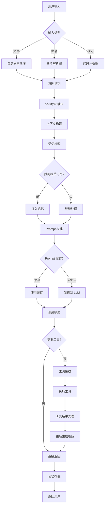

### 数据转换过程

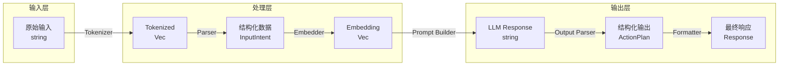

---

## 记忆存储数据流

### 三层记忆存储流程

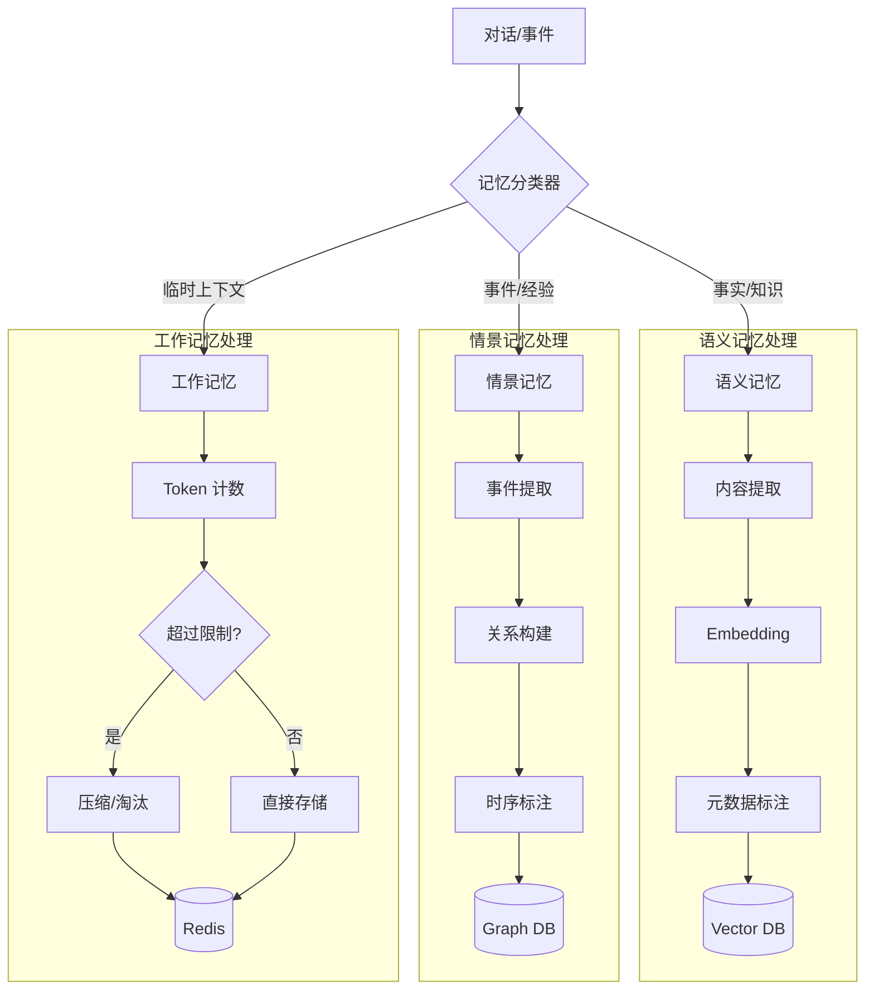

### 记忆检索流程

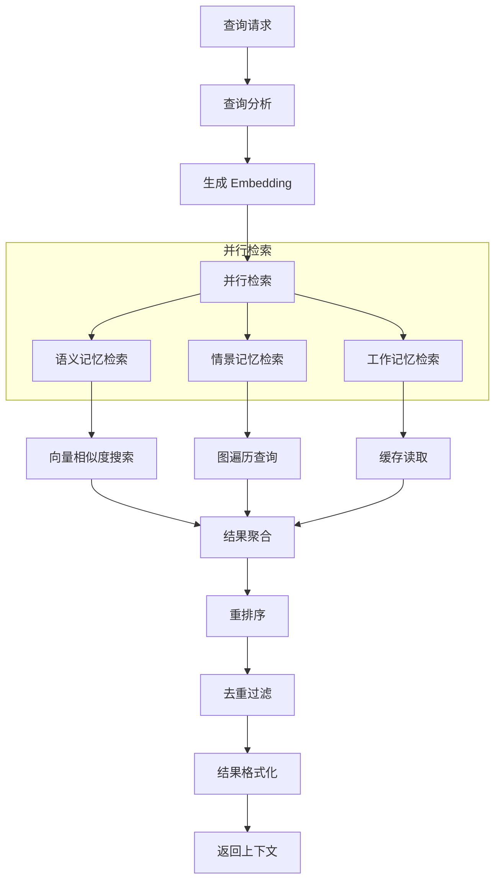

### 记忆同步流程

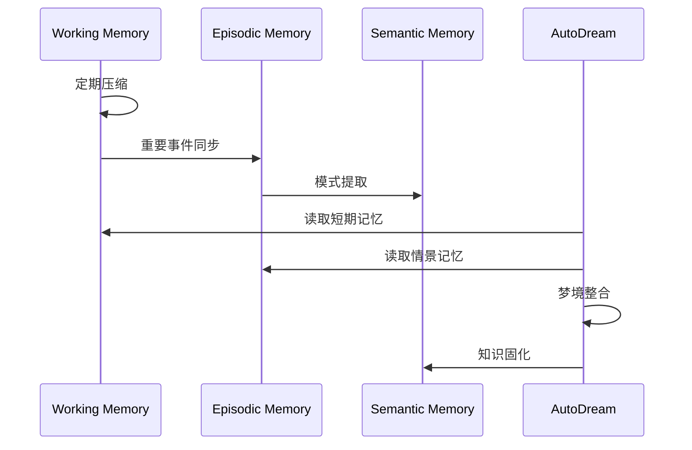

---

## 工具执行数据流

### 工具调用流程

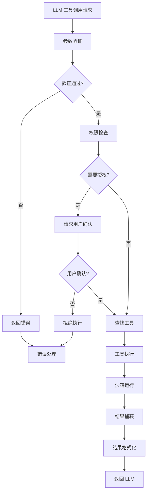

### 工具结果处理流程

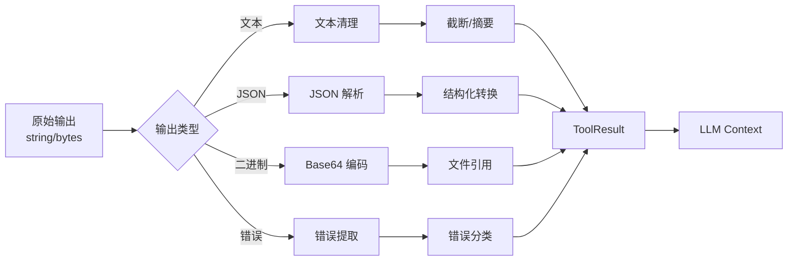

### 批量工具执行流程

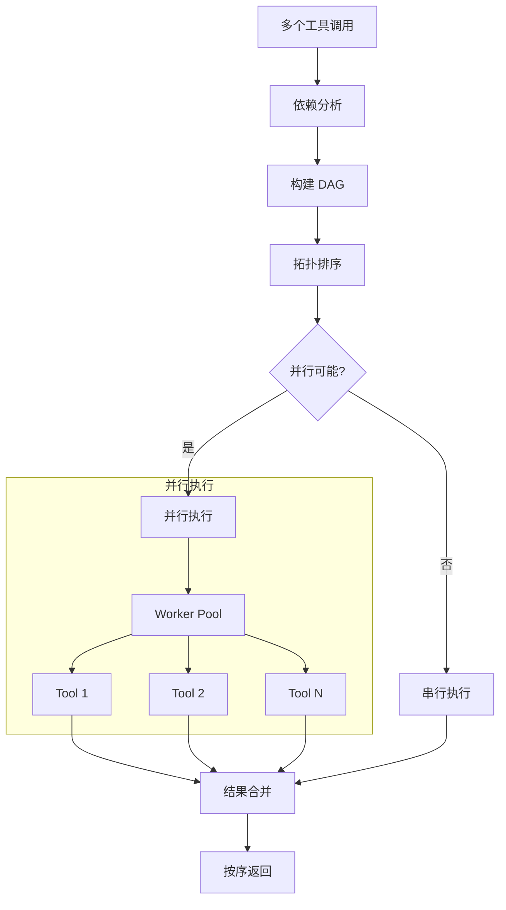

---

## Agent 协作数据流

### 多 Agent 任务分配

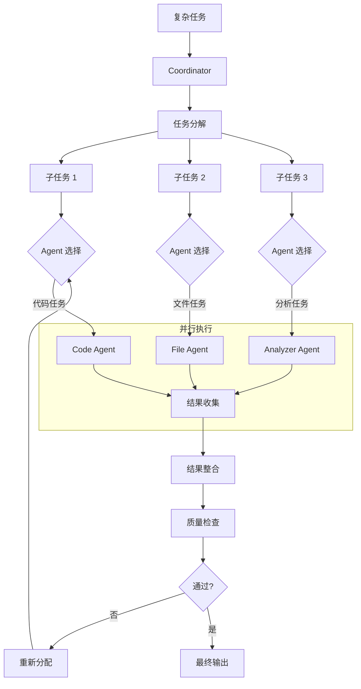

### Agent 间通信

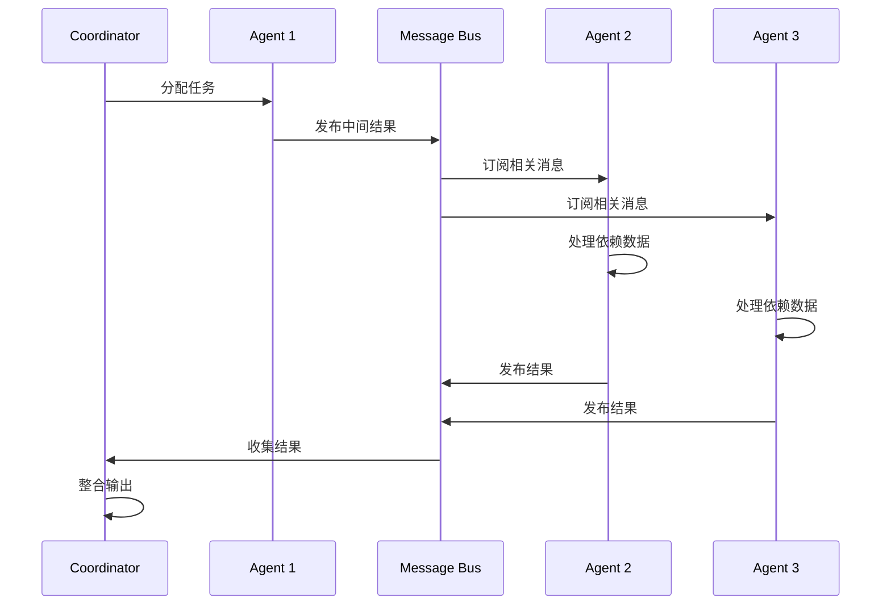

---

## 缓存系统数据流

### 多级缓存查询

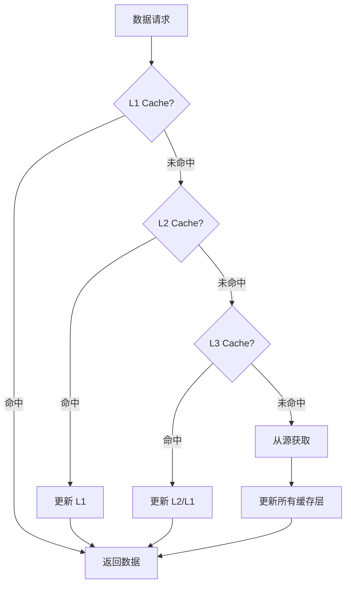

### Prompt 缓存流程

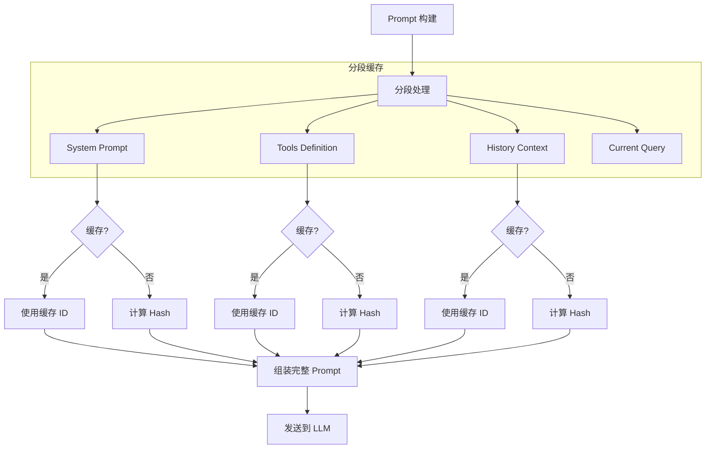

### 缓存失效策略

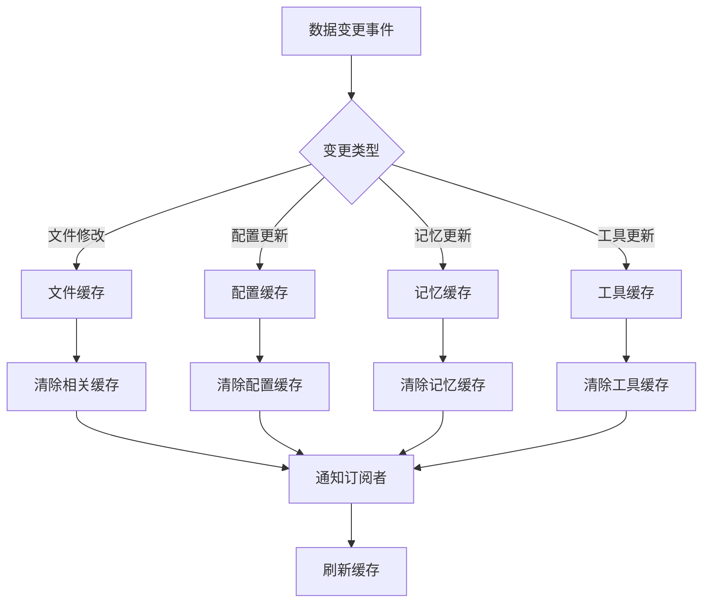

---

## WebSocket 实时数据流

### 实时通信流程

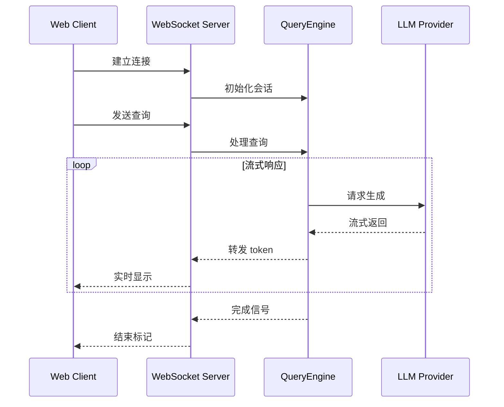

---

## 数据持久化流

### 会话持久化

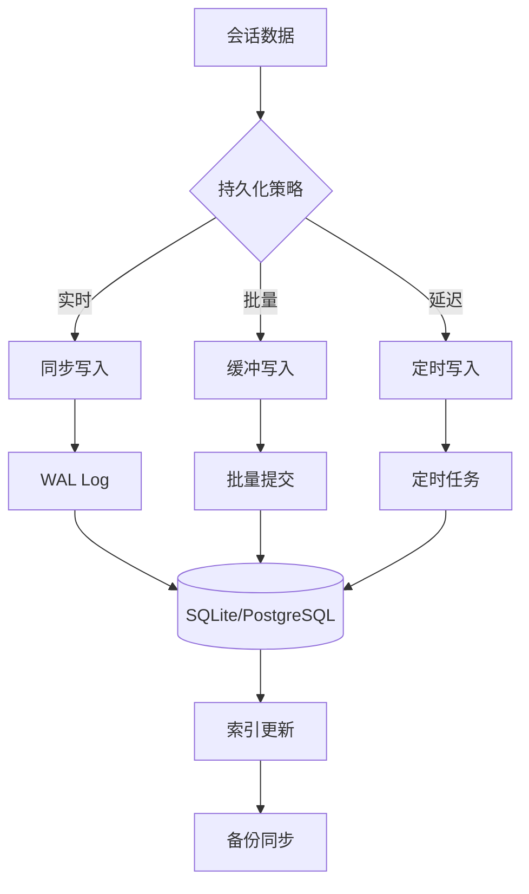

---

*文档版本: 1.0.0 | 最后更新: 2026-04-02*
