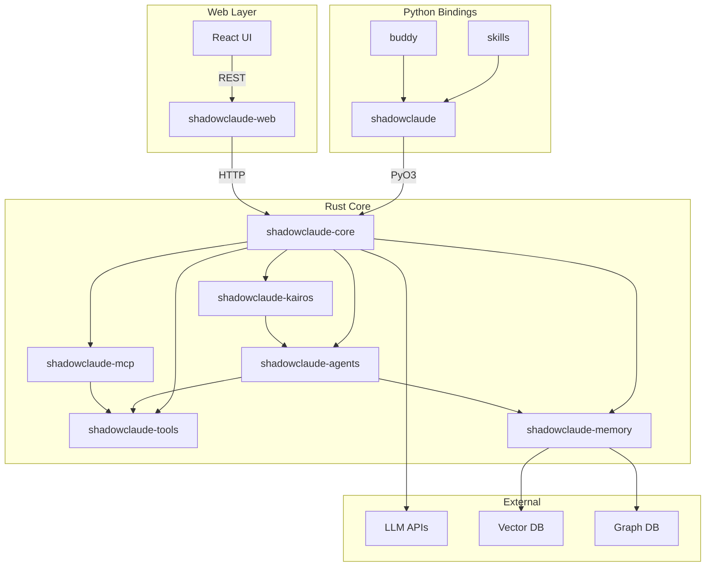
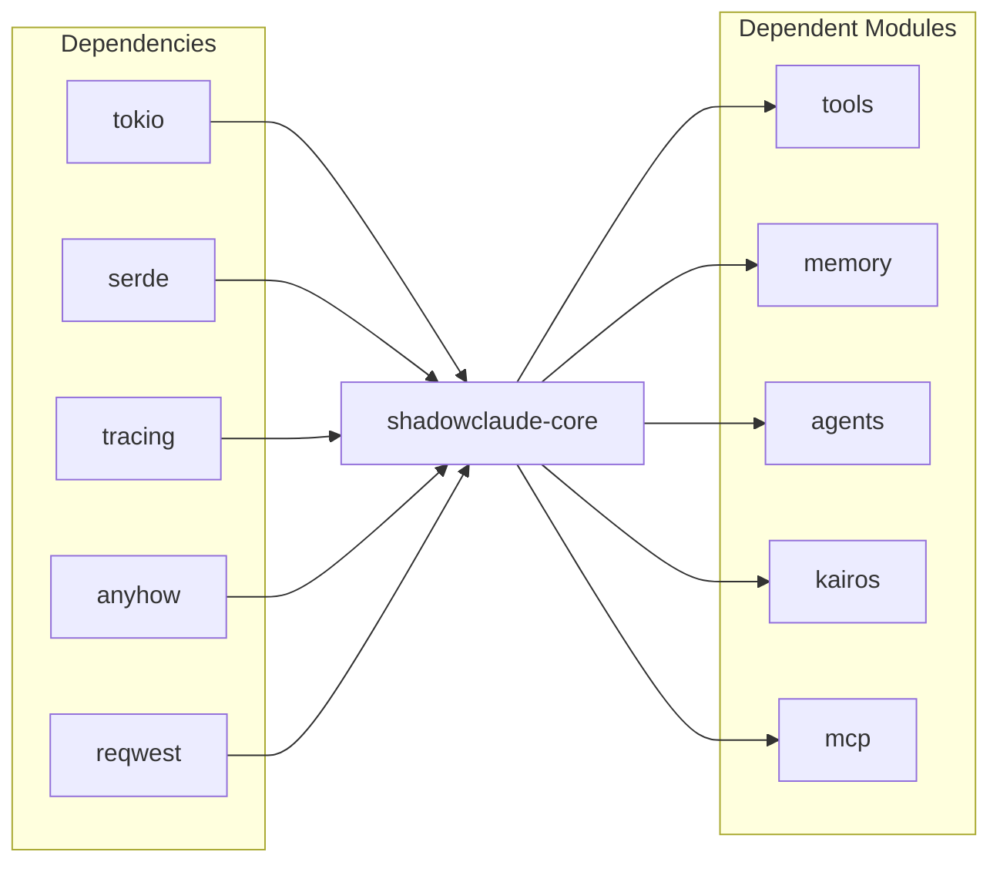
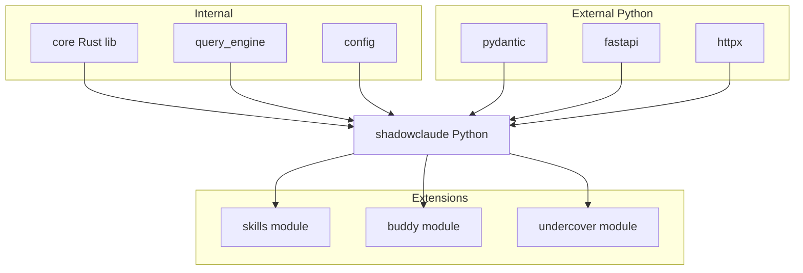
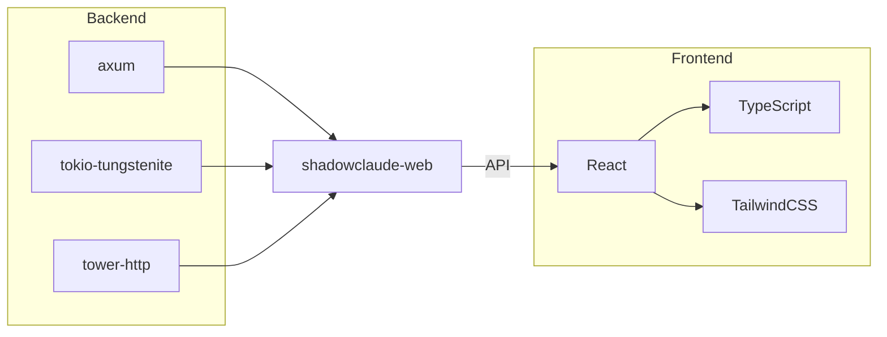
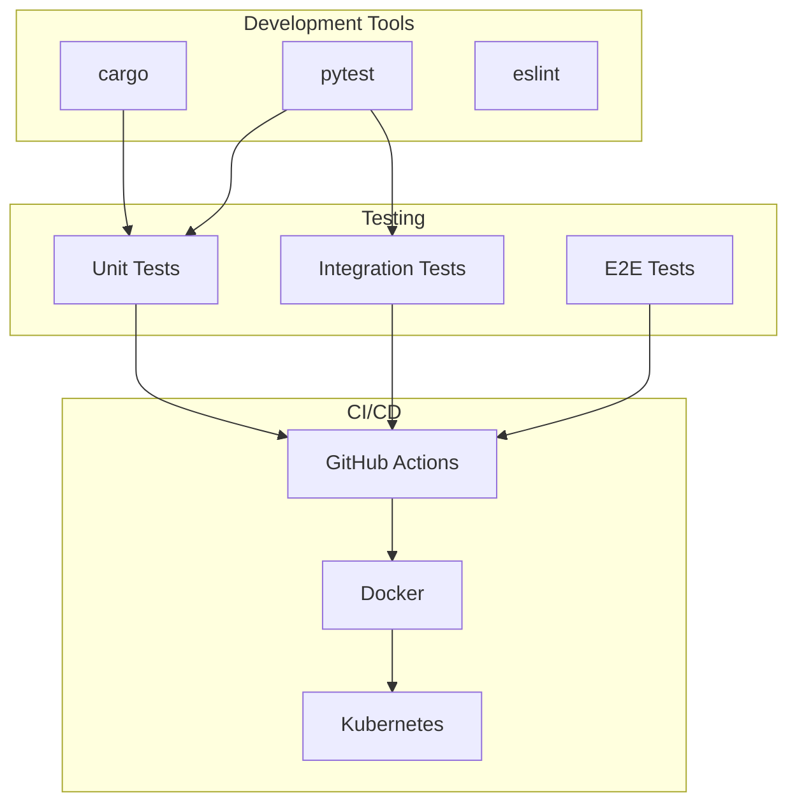
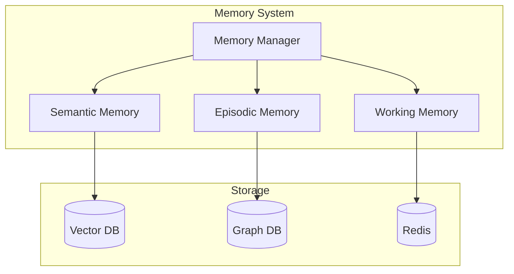
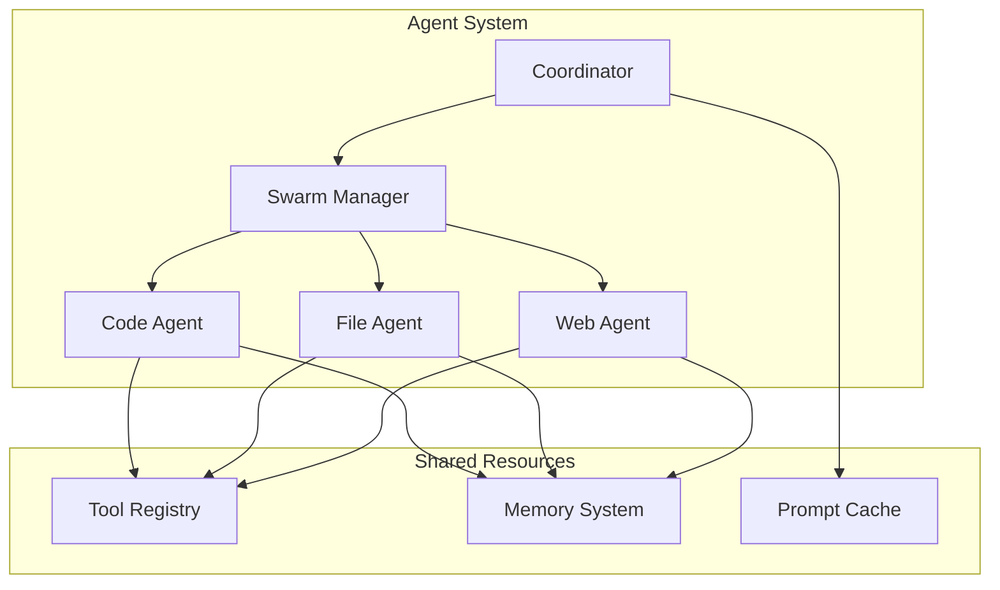
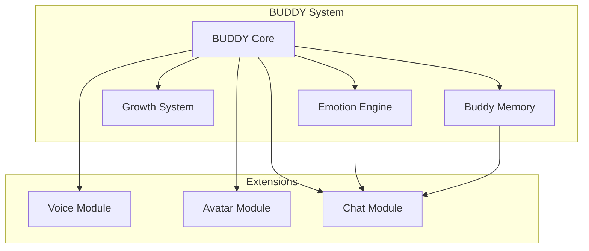
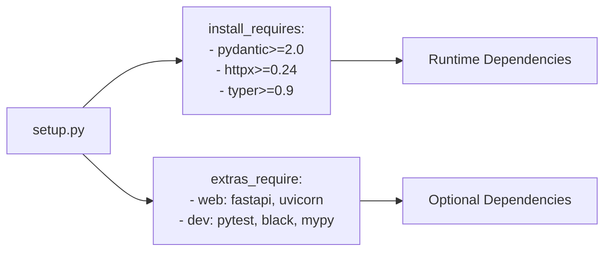

# ShadowClaude 模块依赖图

本文档详细描述 ShadowClaude 各模块之间的依赖关系和交互方式。

## 总体依赖图



## 核心模块依赖

### shadowclaude-core



### 依赖详情

| 模块 | 上游依赖 | 下游被依赖 |
|------|----------|------------|
| core | tokio, serde, tracing | tools, memory, agents, kairos, mcp, python |
| tools | core, regex, walkdir | agents, mcp |
| memory | core, qdrant-client, neo4rs | agents |
| agents | core, tools, memory | kairos, python |
| kairos | core, agents, notify | python |
| mcp | core, tools, serde_json | - |

## Python 绑定依赖



## Web 层依赖



## 开发依赖图



## 功能模块关系

### 记忆系统内部依赖



### Agent 系统依赖



### BUDDY 系统依赖



## 构建依赖

### Cargo.toml 依赖关系

```mermaid
flowchart TB
    subgraph "Workspace Root"
        workspace[Cargo.toml<br/>workspace.members]
    end
    
    subgraph "Crates"
        core[Cargo.toml<br/>shadowclaude-core]
        tools[Cargo.toml<br/>shadowclaude-tools]
        memory[Cargo.toml<br/>shadowclaude-memory]
        agents[Cargo.toml<br/>shadowclaude-agents]
        kairos[Cargo.toml<br/>shadowclaude-kairos]
        mcp[Cargo.toml<br/>shadowclaude-mcp]
    end
    
    workspace --> core
    workspace --> tools
    workspace --> memory
    workspace --> agents
    workspace --> kairos
    workspace --> mcp
    
    core -. optional .> tools
    core -. optional .> memory
    agents --> core
    agents --> tools
    agents --> memory
    kairos --> core
    kairos --> agents
```

### Python setup.py 依赖



## 版本兼容性矩阵

| 模块 | Rust 版本 | Python 版本 | 兼容性 |
|------|-----------|-------------|--------|
| core | >= 1.75 | - | ✅ Stable |
| tools | >= 1.75 | - | ✅ Stable |
| memory | >= 1.75 | - | ✅ Stable |
| agents | >= 1.75 | >= 3.9 | ✅ Stable |
| kairos | >= 1.75 | >= 3.9 | ✅ Stable |
| mcp | >= 1.75 | >= 3.9 | ✅ Stable |
| python | - | >= 3.9 | ✅ Stable |

## 依赖升级策略

1. **核心依赖**: tokio, serde 等基础库跟随最新稳定版本
2. **功能依赖**: qdrant-client, neo4rs 等功能库每季度评估升级
3. **Python 依赖**: 遵循语义化版本，小版本自动升级
4. **安全更新**: 关键安全漏洞 24 小时内修复

---

*文档版本: 1.0.0 | 最后更新: 2026-04-02*
