# ShadowClaude 时序图

本文档通过时序图详细描述 ShadowClaude 各组件之间的交互顺序和时间关系。

## 目录

1. [用户查询处理时序](#用户查询处理时序)
2. [工具执行时序](#工具执行时序)
3. [Agent 协作时序](#agent-协作时序)
4. [记忆系统时序](#记忆系统时序)
5. [初始化与关闭时序](#初始化与关闭时序)

---

## 用户查询处理时序

### 标准查询流程

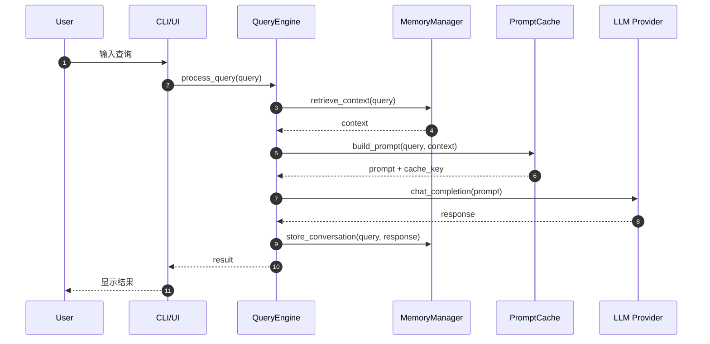
```mermaid
sequenceDiagram
    autonumber
    participant U as User
    participant CLI as CLI/UI
    participant QE as QueryEngine
    participant Mem as MemoryManager
    participant Cache as PromptCache
    participant LLM as LLM Provider

    U->>CLI: 输入查询
    CLI->>QE: process_query(query)
    
    QE->>Mem: retrieve_context(query)
    Mem-->>QE: context
    
    QE->>Cache: build_prompt(query, context)
    Cache-->>QE: prompt + cache_key
    
    QE->>LLM: chat_completion(prompt)
    LLM-->>QE: response
    
    QE->>Mem: store_conversation(query, response)
    QE-->>CLI: result
    CLI-->>U: 显示结果
```

### 多轮对话流程

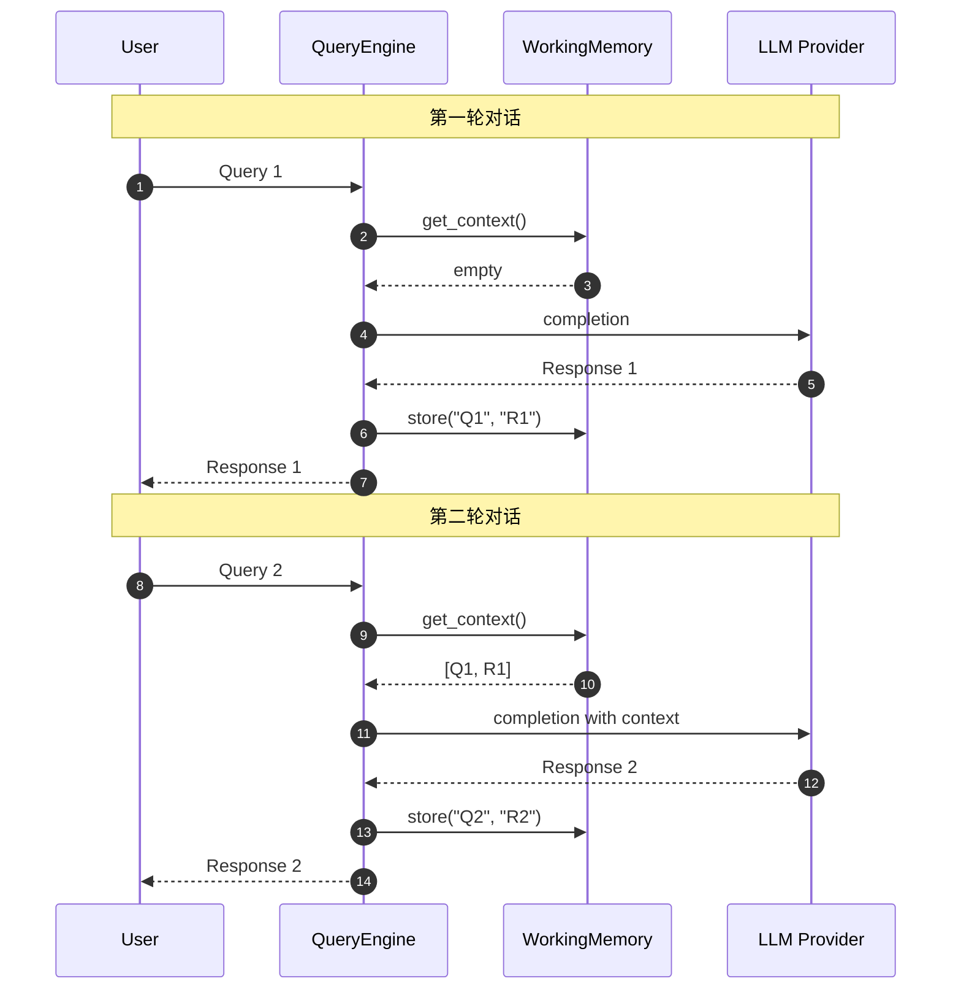
```mermaid
sequenceDiagram
    autonumber
    participant U as User
    participant QE as QueryEngine
    participant WM as WorkingMemory
    participant LLM as LLM Provider

    Note over U,LLM: 第一轮对话
    U->>QE: Query 1
    QE->>WM: get_context()
    WM-->>QE: empty
    QE->>LLM: completion
    LLM-->>QE: Response 1
    QE->>WM: store("Q1", "R1")
    QE-->>U: Response 1

    Note over U,LLM: 第二轮对话
    U->>QE: Query 2
    QE->>WM: get_context()
    WM-->>QE: [Q1, R1]
    QE->>LLM: completion with context
    LLM-->>QE: Response 2
    QE->>WM: store("Q2", "R2")
    QE-->>U: Response 2
```

### 流式响应流程

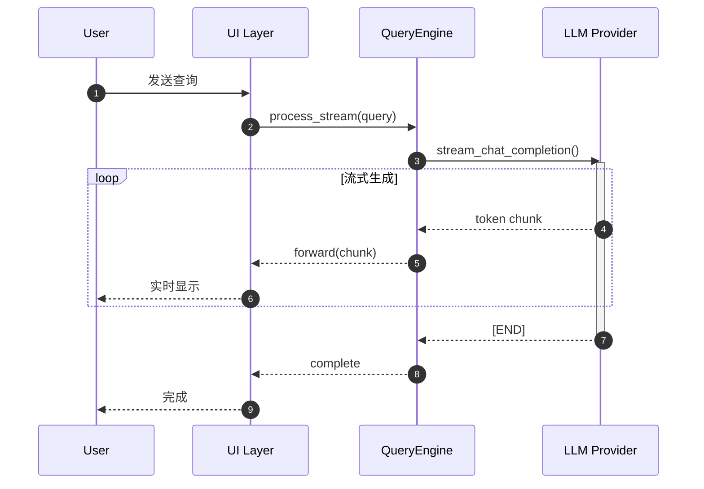
```mermaid
sequenceDiagram
    autonumber
    participant U as User
    participant UI as UI Layer
    participant QE as QueryEngine
    participant LLM as LLM Provider

    U->>UI: 发送查询
    UI->>QE: process_stream(query)
    
    QE->>LLM: stream_chat_completion()
    activate LLM
    
    loop 流式生成
        LLM-->>QE: token chunk
        QE-->>UI: forward(chunk)
        UI-->>U: 实时显示
    end
    
    LLM-->>QE: [END]
    deactivate LLM
    
    QE-->>UI: complete
    UI-->>U: 完成
```

---

## 工具执行时序

### 单次工具调用

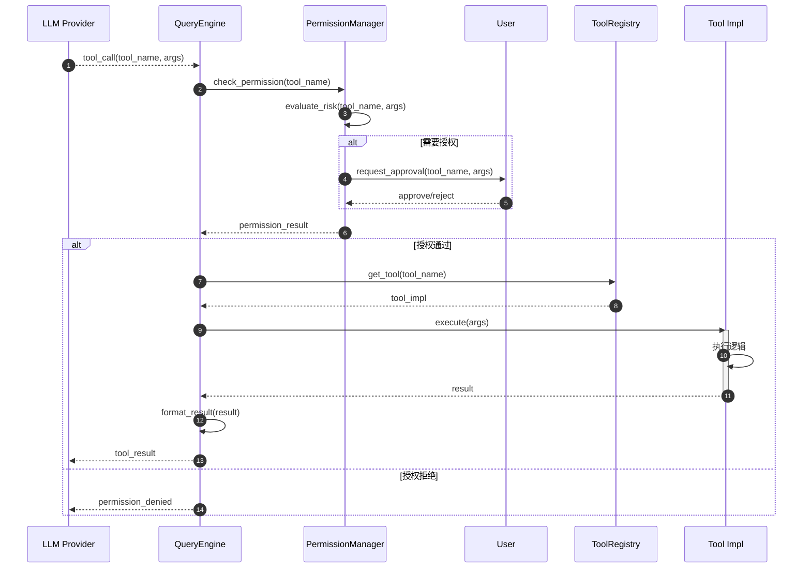
```mermaid
sequenceDiagram
    autonumber
    participant LLM as LLM Provider
    participant QE as QueryEngine
    participant PM as PermissionManager
    participant U as User
    participant TR as ToolRegistry
    participant Tool as Tool Impl

    LLM-->>QE: tool_call(tool_name, args)
    
    QE->>PM: check_permission(tool_name)
    PM->>PM: evaluate_risk(tool_name, args)
    
    alt 需要授权
        PM->>U: request_approval(tool_name, args)
        U-->>PM: approve/reject
    end
    
    PM-->>QE: permission_result
    
    alt 授权通过
        QE->>TR: get_tool(tool_name)
        TR-->>QE: tool_impl
        
        QE->>Tool: execute(args)
        activate Tool
        Tool->>Tool: 执行逻辑
        Tool-->>QE: result
        deactivate Tool
        
        QE->>QE: format_result(result)
        QE-->>LLM: tool_result
    else 授权拒绝
        QE-->>LLM: permission_denied
    end
```

### 多工具并行执行

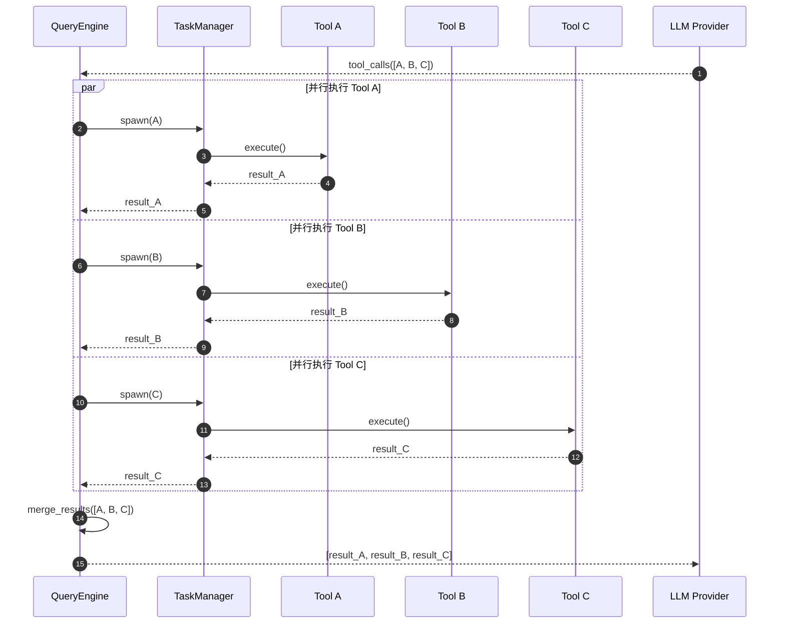
```mermaid
sequenceDiagram
    autonumber
    participant QE as QueryEngine
    participant TM as TaskManager
    participant T1 as Tool A
    participant T2 as Tool B
    participant T3 as Tool C
    participant LLM as LLM Provider

    LLM-->>QE: tool_calls([A, B, C])
    
    par 并行执行 Tool A
        QE->>TM: spawn(A)
        TM->>T1: execute()
        T1-->>TM: result_A
        TM-->>QE: result_A
    and 并行执行 Tool B
        QE->>TM: spawn(B)
        TM->>T2: execute()
        T2-->>TM: result_B
        TM-->>QE: result_B
    and 并行执行 Tool C
        QE->>TM: spawn(C)
        TM->>T3: execute()
        T3-->>TM: result_C
        TM-->>QE: result_C
    end
    
    QE->>QE: merge_results([A, B, C])
    QE-->>LLM: [result_A, result_B, result_C]
```

### 工具链执行

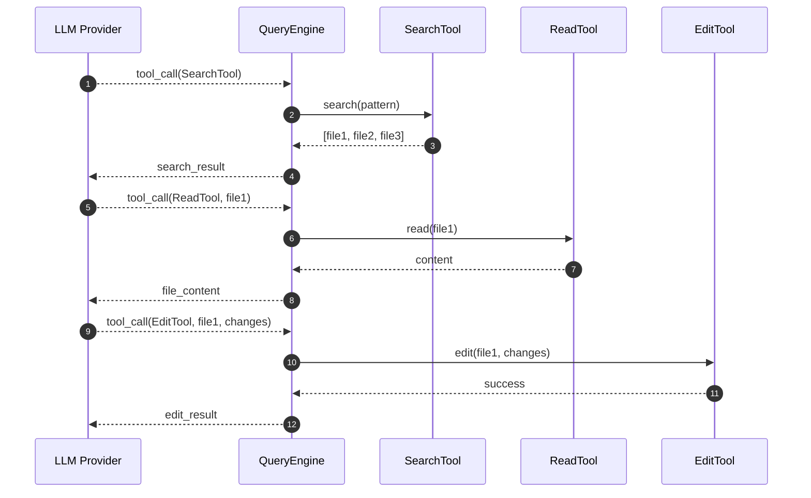
```mermaid
sequenceDiagram
    autonumber
    participant LLM as LLM Provider
    participant QE as QueryEngine
    participant T1 as SearchTool
    participant T2 as ReadTool
    participant T3 as EditTool

    LLM-->>QE: tool_call(SearchTool)
    QE->>T1: search(pattern)
    T1-->>QE: [file1, file2, file3]
    QE-->>LLM: search_result

    LLM-->>QE: tool_call(ReadTool, file1)
    QE->>T2: read(file1)
    T2-->>QE: content
    QE-->>LLM: file_content

    LLM-->>QE: tool_call(EditTool, file1, changes)
    QE->>T3: edit(file1, changes)
    T3-->>QE: success
    QE-->>LLM: edit_result
```

---

## Agent 协作时序

### Coordinator 任务分配

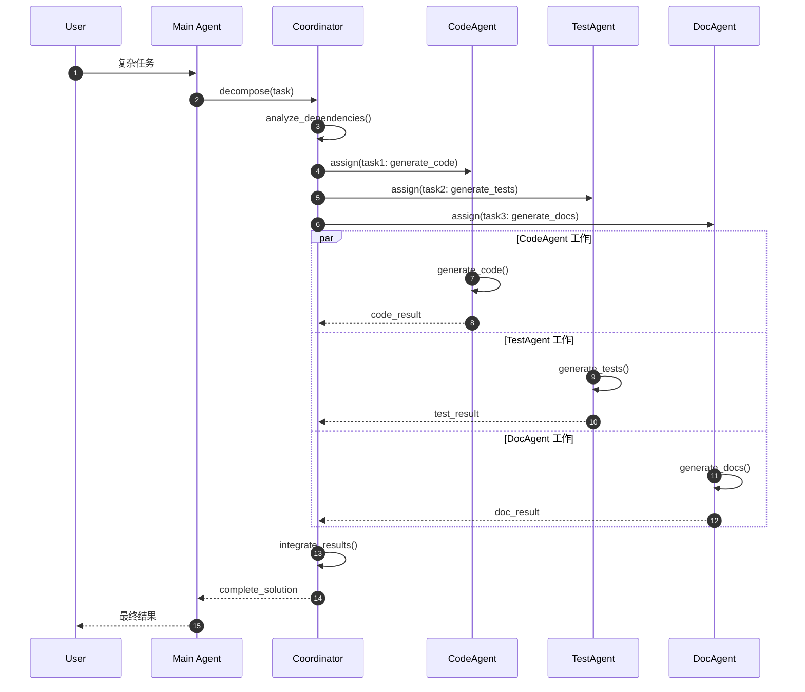
```mermaid
sequenceDiagram
    autonumber
    participant U as User
    participant Main as Main Agent
    participant Coord as Coordinator
    participant A1 as CodeAgent
    participant A2 as TestAgent
    participant A3 as DocAgent

    U->>Main: 复杂任务
    Main->>Coord: decompose(task)
    
    Coord->>Coord: analyze_dependencies()
    
    Coord->>A1: assign(task1: generate_code)
    Coord->>A2: assign(task2: generate_tests)
    Coord->>A3: assign(task3: generate_docs)
    
    par CodeAgent 工作
        A1->>A1: generate_code()
        A1-->>Coord: code_result
    and TestAgent 工作
        A2->>A2: generate_tests()
        A2-->>Coord: test_result
    and DocAgent 工作
        A3->>A3: generate_docs()
        A3-->>Coord: doc_result
    end
    
    Coord->>Coord: integrate_results()
    Coord-->>Main: complete_solution
    Main-->>U: 最终结果
```

### Agent 间通信

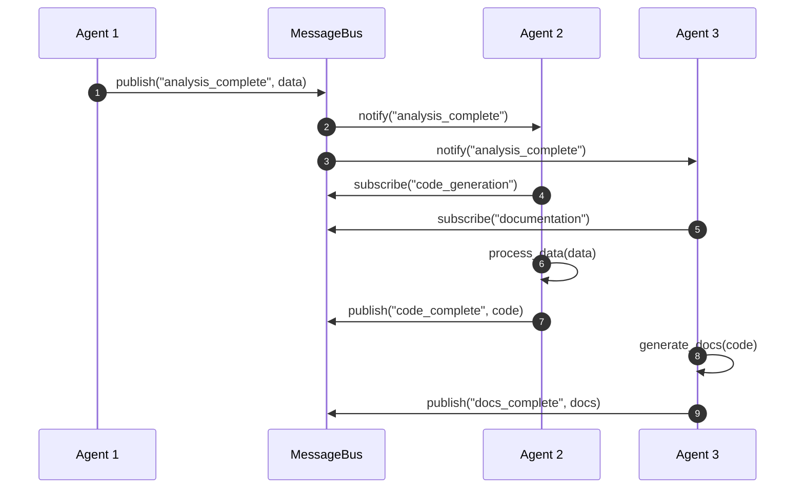
```mermaid
sequenceDiagram
    autonumber
    participant A1 as Agent 1
    participant Bus as MessageBus
    participant A2 as Agent 2
    participant A3 as Agent 3

    A1->>Bus: publish("analysis_complete", data)
    
    Bus->>A2: notify("analysis_complete")
    Bus->>A3: notify("analysis_complete")
    
    A2->>Bus: subscribe("code_generation")
    A3->>Bus: subscribe("documentation")
    
    A2->>A2: process_data(data)
    A2->>Bus: publish("code_complete", code)
    
    A3->>A3: generate_docs(code)
    A3->>Bus: publish("docs_complete", docs)
```

### 子 Agent 生命周期

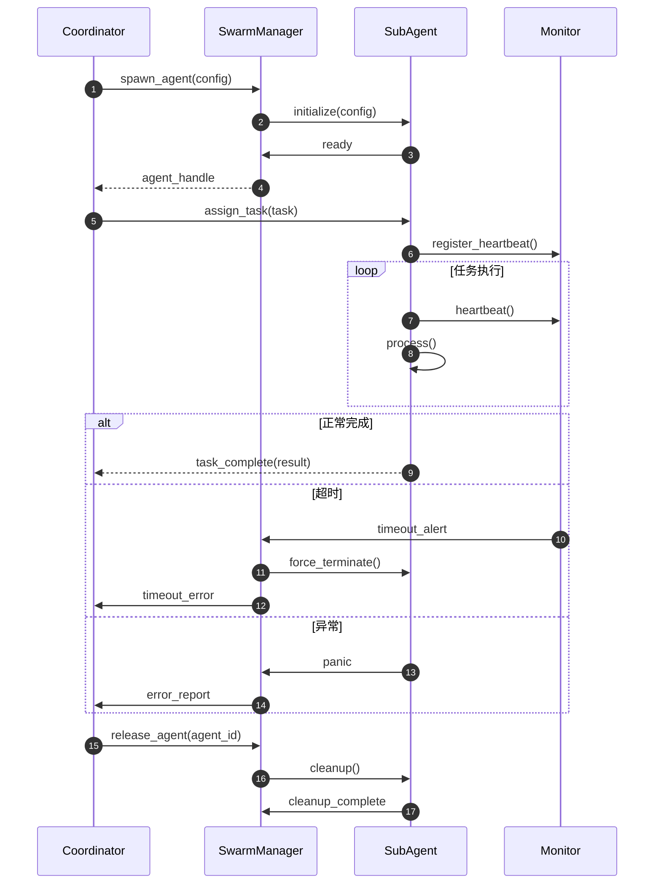
```mermaid
sequenceDiagram
    autonumber
    participant Coord as Coordinator
    participant SW as SwarmManager
    participant Sub as SubAgent
    participant Mon as Monitor

    Coord->>SW: spawn_agent(config)
    SW->>Sub: initialize(config)
    Sub->>SW: ready
    SW-->>Coord: agent_handle
    
    Coord->>Sub: assign_task(task)
    Sub->>Mon: register_heartbeat()
    
    loop 任务执行
        Sub->>Mon: heartbeat()
        Sub->>Sub: process()
    end
    
    alt 正常完成
        Sub-->>Coord: task_complete(result)
    else 超时
        Mon->>SW: timeout_alert
        SW->>Sub: force_terminate()
        SW->>Coord: timeout_error
    else 异常
        Sub->>SW: panic
        SW->>Coord: error_report
    end
    
    Coord->>SW: release_agent(agent_id)
    SW->>Sub: cleanup()
    Sub->>SW: cleanup_complete
```

---

## 记忆系统时序

### 记忆存储流程

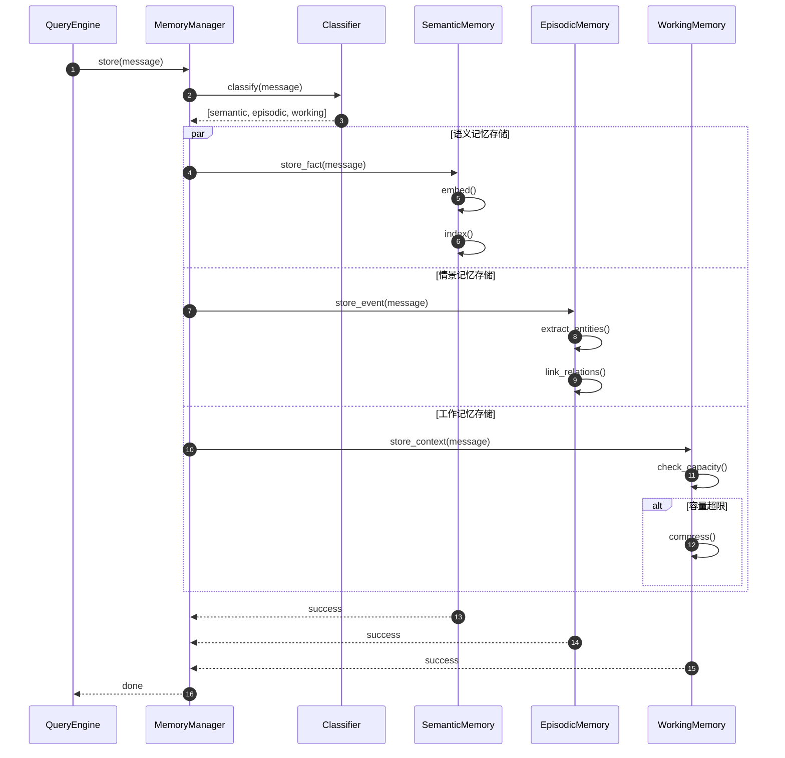
```mermaid
sequenceDiagram
    autonumber
    participant QE as QueryEngine
    participant Mem as MemoryManager
    participant Cls as Classifier
    participant SM as SemanticMemory
    participant EM as EpisodicMemory
    participant WM as WorkingMemory

    QE->>Mem: store(message)
    
    Mem->>Cls: classify(message)
    Cls-->>Mem: [semantic, episodic, working]
    
    par 语义记忆存储
        Mem->>SM: store_fact(message)
        SM->>SM: embed()
        SM->>SM: index()
    and 情景记忆存储
        Mem->>EM: store_event(message)
        EM->>EM: extract_entities()
        EM->>EM: link_relations()
    and 工作记忆存储
        Mem->>WM: store_context(message)
        WM->>WM: check_capacity()
        alt 容量超限
            WM->>WM: compress()
        end
    end
    
    SM-->>Mem: success
    EM-->>Mem: success
    WM-->>Mem: success
    Mem-->>QE: done
```

### 记忆检索流程

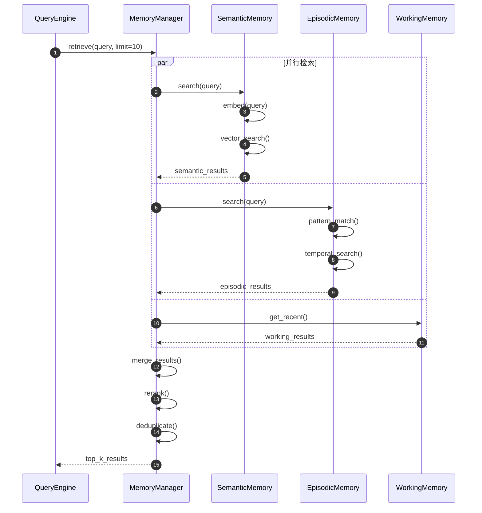
```mermaid
sequenceDiagram
    autonumber
    participant QE as QueryEngine
    participant Mem as MemoryManager
    participant SM as SemanticMemory
    participant EM as EpisodicMemory
    participant WM as WorkingMemory

    QE->>Mem: retrieve(query, limit=10)
    
    par 并行检索
        Mem->>SM: search(query)
        SM->>SM: embed(query)
        SM->>SM: vector_search()
        SM-->>Mem: semantic_results
    and
        Mem->>EM: search(query)
        EM->>EM: pattern_match()
        EM->>EM: temporal_search()
        EM-->>Mem: episodic_results
    and
        Mem->>WM: get_recent()
        WM-->>Mem: working_results
    end
    
    Mem->>Mem: merge_results()
    Mem->>Mem: rerank()
    Mem->>Mem: deduplicate()
    
    Mem-->>QE: top_k_results
```

### 记忆同步 (AutoDream)

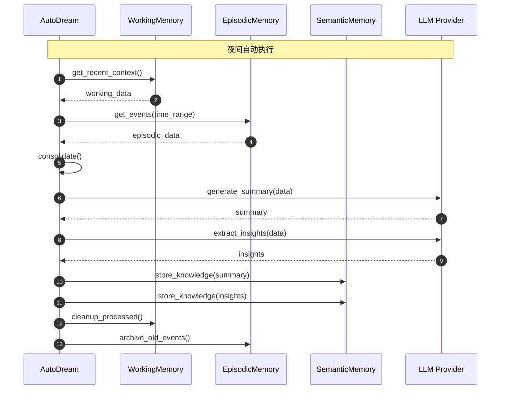
```mermaid
sequenceDiagram
    autonumber
    participant AD as AutoDream
    participant WM as WorkingMemory
    participant EM as EpisodicMemory
    participant SM as SemanticMemory
    participant LLM as LLM Provider

    Note over AD,LLM: 夜间自动执行
    
    AD->>WM: get_recent_context()
    WM-->>AD: working_data
    
    AD->>EM: get_events(time_range)
    EM-->>AD: episodic_data
    
    AD->>AD: consolidate()
    
    AD->>LLM: generate_summary(data)
    LLM-->>AD: summary
    
    AD->>LLM: extract_insights(data)
    LLM-->>AD: insights
    
    AD->>SM: store_knowledge(summary)
    AD->>SM: store_knowledge(insights)
    
    AD->>WM: cleanup_processed()
    AD->>EM: archive_old_events()
```

---

## 初始化与关闭时序

### 系统初始化

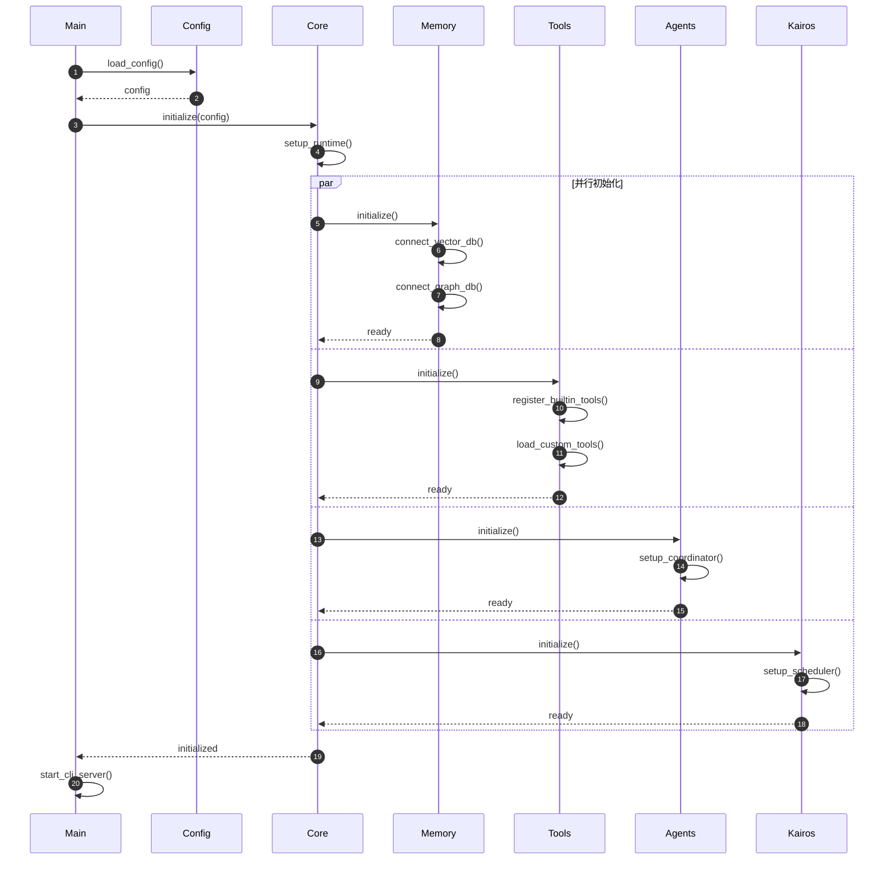
```mermaid
sequenceDiagram
    autonumber
    participant Main as Main
    participant Config as Config
    participant Core as Core
    participant Mem as Memory
    participant Tools as Tools
    participant Agents as Agents
    participant Kairos as Kairos

    Main->>Config: load_config()
    Config-->>Main: config
    
    Main->>Core: initialize(config)
    Core->>Core: setup_runtime()
    
    par 并行初始化
        Core->>Mem: initialize()
        Mem->>Mem: connect_vector_db()
        Mem->>Mem: connect_graph_db()
        Mem-->>Core: ready
    and
        Core->>Tools: initialize()
        Tools->>Tools: register_builtin_tools()
        Tools->>Tools: load_custom_tools()
        Tools-->>Core: ready
    and
        Core->>Agents: initialize()
        Agents->>Agents: setup_coordinator()
        Agents-->>Core: ready
    and
        Core->>Kairos: initialize()
        Kairos->>Kairos: setup_scheduler()
        Kairos-->>Core: ready
    end
    
    Core-->>Main: initialized
    Main->>Main: start_cli_server()
```

### 优雅关闭

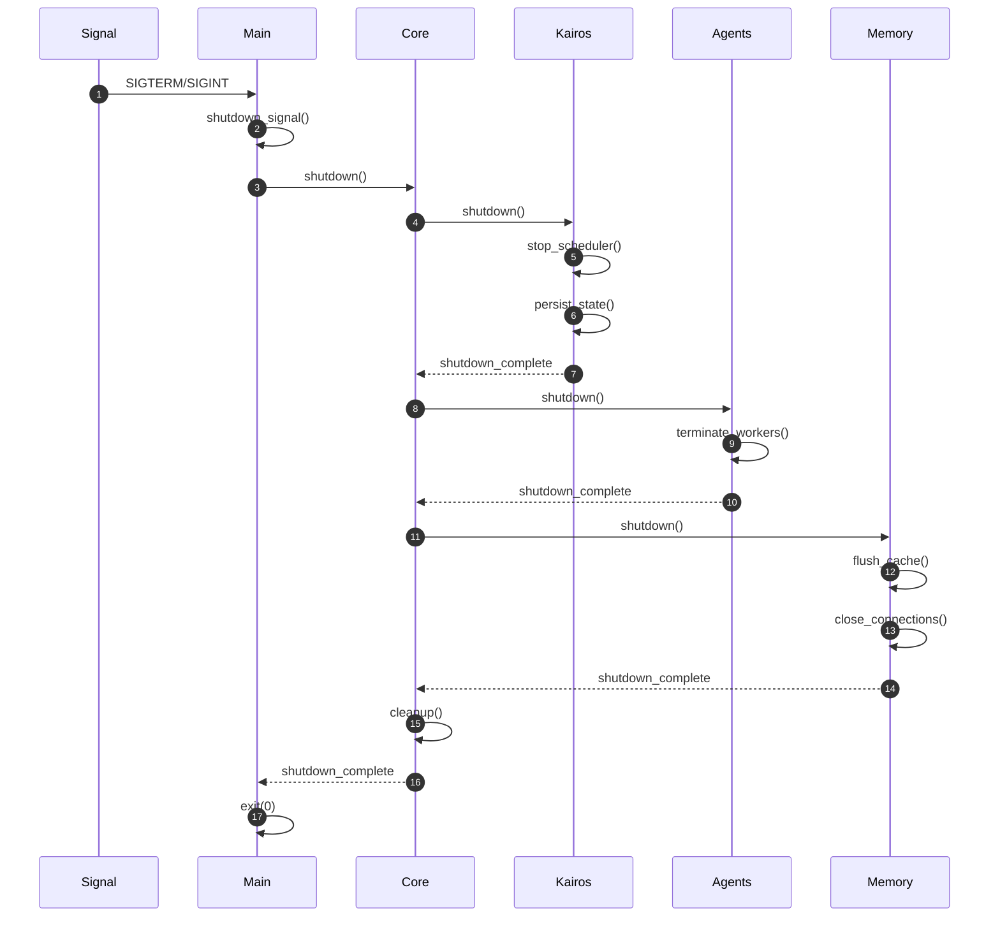
```mermaid
sequenceDiagram
    autonumber
    participant Signal as Signal
    participant Main as Main
    participant Core as Core
    participant Kairos as Kairos
    participant Agents as Agents
    participant Mem as Memory

    Signal->>Main: SIGTERM/SIGINT
    Main->>Main: shutdown_signal()
    
    Main->>Core: shutdown()
    
    Core->>Kairos: shutdown()
    Kairos->>Kairos: stop_scheduler()
    Kairos->>Kairos: persist_state()
    Kairos-->>Core: shutdown_complete
    
    Core->>Agents: shutdown()
    Agents->>Agents: terminate_workers()
    Agents-->>Core: shutdown_complete
    
    Core->>Mem: shutdown()
    Mem->>Mem: flush_cache()
    Mem->>Mem: close_connections()
    Mem-->>Core: shutdown_complete
    
    Core->>Core: cleanup()
    Core-->>Main: shutdown_complete
    
    Main->>Main: exit(0)
```

---

## 错误处理时序

### 错误恢复流程

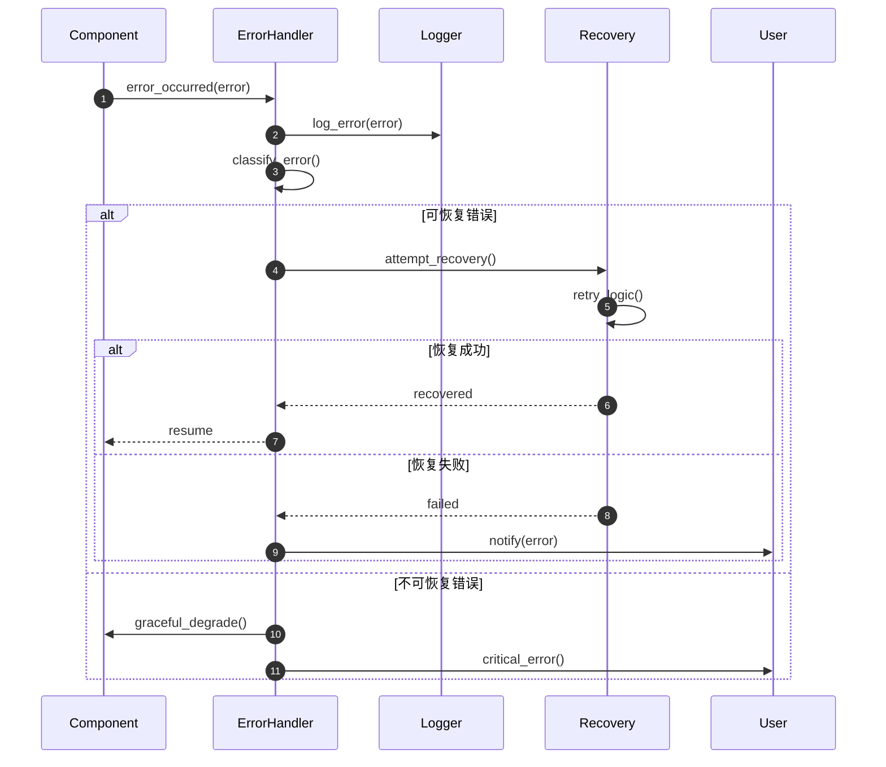
```mermaid
sequenceDiagram
    autonumber
    participant Comp as Component
    participant Err as ErrorHandler
    participant Log as Logger
    participant Rec as Recovery
    participant U as User

    Comp->>Err: error_occurred(error)
    
    Err->>Log: log_error(error)
    Err->>Err: classify_error()
    
    alt 可恢复错误
        Err->>Rec: attempt_recovery()
        Rec->>Rec: retry_logic()
        alt 恢复成功
            Rec-->>Err: recovered
            Err-->>Comp: resume
        else 恢复失败
            Rec-->>Err: failed
            Err->>U: notify(error)
        end
    else 不可恢复错误
        Err->>Comp: graceful_degrade()
        Err->>U: critical_error()
    end
```

---

*文档版本: 1.0.0 | 最后更新: 2026-04-02*
