# ShadowClaude 系统架构设计

> 版本: 1.0.0 | 最后更新: 2026-04-02

## 目录

1. [概述](#概述)
2. [设计哲学](#设计哲学)
3. [系统总览](#系统总览)
4. [核心组件详解](#核心组件详解)
5. [数据流架构](#数据流架构)
6. [内存与状态管理](#内存与状态管理)
7. [安全架构](#安全架构)
8. [扩展性设计](#扩展性设计)
9. [性能优化策略](#性能优化策略)
10. [部署架构](#部署架构)

---

## 概述

ShadowClaude 是一个功能完整的 AI 编程助手框架，基于 Rust 和 Python 双语言构建，旨在提供与 Claude Code 相媲美的开发体验。本架构文档详细描述了 ShadowClaude 的系统设计、组件交互和技术实现。

### 项目定位

ShadowClaude 不仅仅是一个命令行工具，它是一个完整的 AI 助手生态系统，包含：

- **核心运行时**: 基于 Rust 的高性能执行引擎
- **Python 绑定**: 丰富的脚本扩展能力
- **Web 界面**: 现代化的 React 前端
- **多 Agent 系统**: Coordinator + Swarm 协作模式
- **三层记忆系统**: Semantic/Episodic/Working Memory
- **赛博宠物系统**: BUDDY 情感陪伴模块
- **守护进程模式**: KAIROS 后台服务

### 核心特性

| 特性 | 描述 | 技术实现 |
|------|------|----------|
| 40+ 工具系统 | 文件操作、代码分析、终端执行等 | Rust + Python 混合实现 |
| 三层记忆 | 语义记忆、情景记忆、工作记忆 | Vector DB + Graph DB |
| Prompt Cache | 分段缓存机制，降低 API 成本 | 智能分段 + 哈希索引 |
| 多 Agent 协作 | Coordinator 调度 + Worker 执行 | Actor 模型 |
| 权限系统 | 六层纵深防御 | Capability-based |
| MCP 协议 | 模型上下文协议支持 | Standard MCP |

---

## 设计哲学

### 1. 性能优先

Rust 核心确保关键路径的零成本抽象，Python 绑定提供灵活的扩展能力。热路径使用 Rust 实现，业务逻辑使用 Python 开发。

### 2. 模块化设计

每个功能模块都是独立 crate/package，可单独使用、测试和发布。模块间通过清晰的接口契约通信。

### 3. 渐进式增强

基础功能开箱即用，高级特性按需启用。用户可以根据需求选择启用 BUDDY、KAIROS、Undercover 等模块。

### 4. 安全第一

六层权限防御体系，确保 AI 助手在受控环境中执行操作。所有敏感操作都需要显式授权。

### 5. 开发者体验

简洁的 API 设计、完善的类型提示、丰富的示例代码、详细的错误信息，让开发者能够快速上手。

---

## 系统总览

### 整体架构图

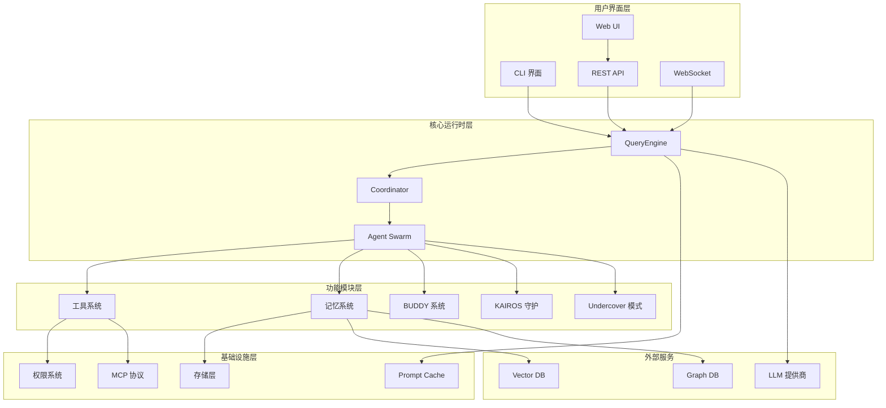

### 组件关系图

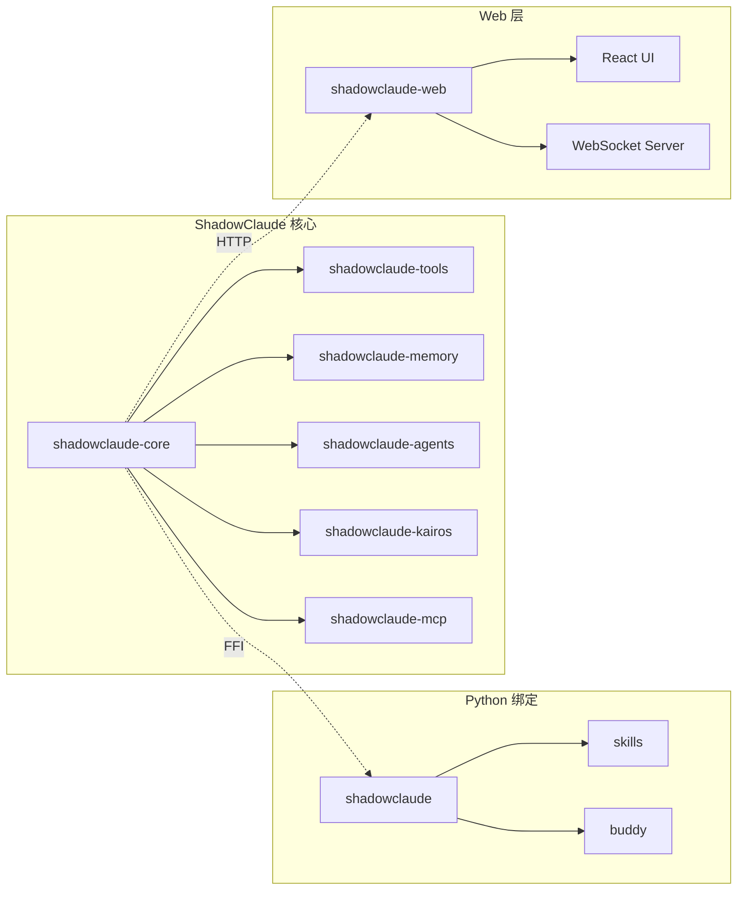

---

## 核心组件详解

### 1. QueryEngine - 查询引擎

QueryEngine 是 ShadowClaude 的核心入口，负责处理用户输入、协调工具执行、管理对话流程。

#### 1.1 架构设计

```rust
pub struct QueryEngine {
    /// 配置管理器
    config: Arc<Config>,
    /// LLM 客户端
    llm: Arc<dyn LlmProvider>,
    /// 工具注册表
    tools: Arc<ToolRegistry>,
    /// 记忆管理器
    memory: Arc<MemoryManager>,
    /// 对话状态
    conversation: ConversationState,
    /// Prompt 缓存
    cache: Arc<PromptCache>,
    /// 权限管理器
    permission: Arc<PermissionManager>,
}
```

#### 1.2 处理流程

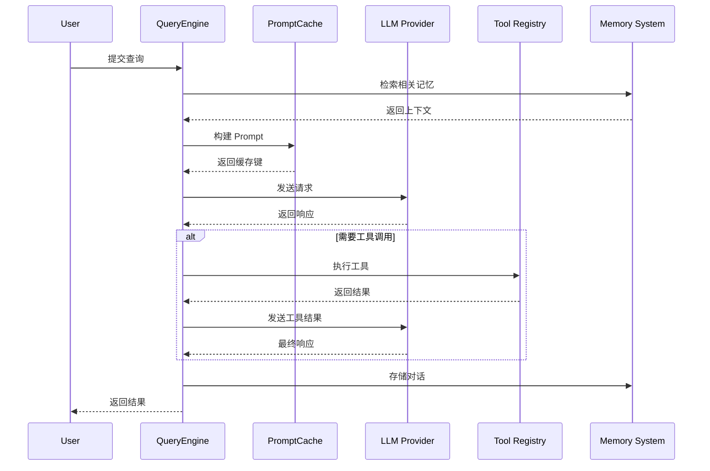

#### 1.3 核心功能

- **输入解析**: 支持自然语言、命令、代码片段等多种输入格式
- **意图识别**: 自动识别用户意图，选择合适的处理策略
- **工具编排**: 智能规划多步骤工具调用序列
- **错误处理**: 优雅处理 LLM 和工具执行错误
- **流式输出**: 支持 SSE 流式响应，提升用户体验

### 2. Coordinator - 协调器

Coordinator 负责管理和调度多个 Agent 的协作，实现复杂的任务分解和执行。

#### 2.1 设计原理

基于 Actor 模型设计，每个 Agent 是一个独立的 Actor，Coordinator 作为消息总线：

```rust
pub struct Coordinator {
    /// Agent 注册表
    agents: HashMap<AgentId, AgentHandle>,
    /// 任务队列
    task_queue: PriorityQueue<Task>,
    /// 消息总线
    message_bus: tokio::sync::broadcast::Sender<Message>,
    /// 状态管理
    state: Arc<RwLock<CoordinatorState>>,
}
```

#### 2.2 Agent 类型系统

```rust
pub enum AgentType {
    /// 代码分析 Agent
    CodeAnalyzer,
    /// 文件操作 Agent
    FileOperator,
    /// 终端执行 Agent
    TerminalExecutor,
    /// Web 搜索 Agent
    WebSearcher,
    /// 自定义 Agent
    Custom(String),
}
```

#### 2.3 任务调度算法

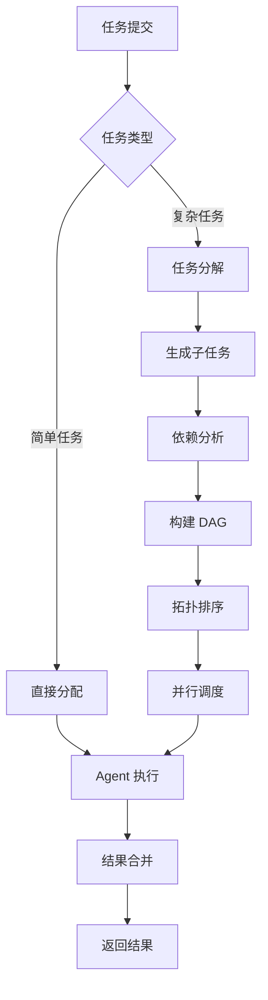

### 3. Memory System - 三层记忆系统

ShadowClaude 采用人类记忆模型设计的三层记忆系统：

#### 3.1 语义记忆 (Semantic Memory)

长期存储的知识和事实，使用向量数据库存储：

```rust
pub struct SemanticMemory {
    /// 向量存储
    vector_store: Arc<dyn VectorStore>,
    /// 嵌入模型
    embedder: Arc<dyn Embedder>,
    /// 索引管理
    index: Arc<RwLock<HashIndex>>,
}
```

**存储内容**:
- 代码知识库
- 项目文档
- 常用命令
- 配置信息

**检索机制**:
- 语义相似度搜索
- 混合检索 (BM25 + 向量)
- 重排序优化

#### 3.2 情景记忆 (Episodic Memory)

存储具体的事件和经验，使用图数据库存储：

```rust
pub struct EpisodicMemory {
    /// 图数据库
    graph: Arc<dyn GraphStore>,
    /// 时间索引
    temporal_index: Arc<TemporalIndex>,
    /// 事件提取器
    event_extractor: Arc<EventExtractor>,
}
```

**存储内容**:
- 对话历史
- 操作记录
- 决策过程
- 学习经验

**检索机制**:
- 时间范围查询
- 相关事件链
- 模式匹配

#### 3.3 工作记忆 (Working Memory)

当前会话的短期上下文：

```rust
pub struct WorkingMemory {
    /// 当前对话上下文
    context: Vec<Message>,
    /// 活跃的实体
    active_entities: HashMap<String, Entity>,
    /// 临时状态
    temp_state: HashMap<String, Value>,
    /// 容量限制
    capacity: usize,
}
```

**管理策略**:
- LRU 淘汰
- 重要性评分
- 上下文压缩
- Token 预算管理

#### 3.4 记忆系统架构图

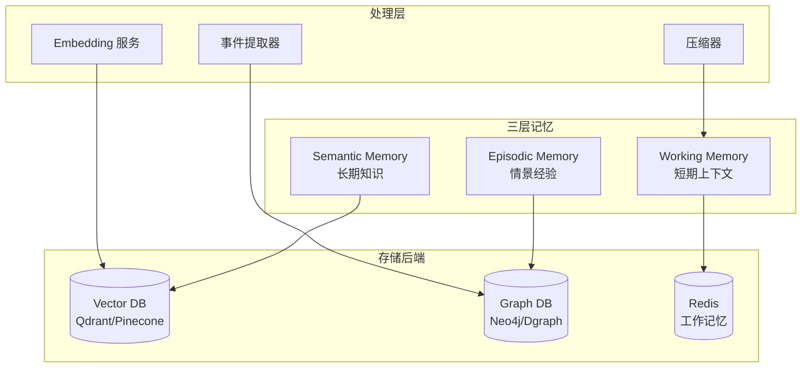

### 4. Tool System - 工具系统

#### 4.1 工具架构

```rust
/// 工具 trait 定义
#[async_trait]
pub trait Tool: Send + Sync {
    /// 工具名称
    fn name(&self) -> &str;
    /// 工具描述
    fn description(&self) -> &str;
    /// 参数模式
    fn parameters(&self) -> &Value;
    /// 执行工具
    async fn execute(&self, args: Value) -> Result<ToolOutput>;
    /// 权限级别
    fn permission_level(&self) -> PermissionLevel;
}
```

#### 4.2 工具分类

| 类别 | 工具数量 | 说明 |
|------|----------|------|
| 文件操作 | 12 | read, write, edit, search, list 等 |
| 终端执行 | 5 | bash, exec, process, tmux 等 |
| 代码分析 | 8 | grep, ast, lint, format 等 |
| Web 工具 | 6 | fetch, search, browser 等 |
| 系统工具 | 5 | env, sys, docker 等 |
| 自定义 | 可扩展 | 用户自定义工具 |

#### 4.3 工具执行流程

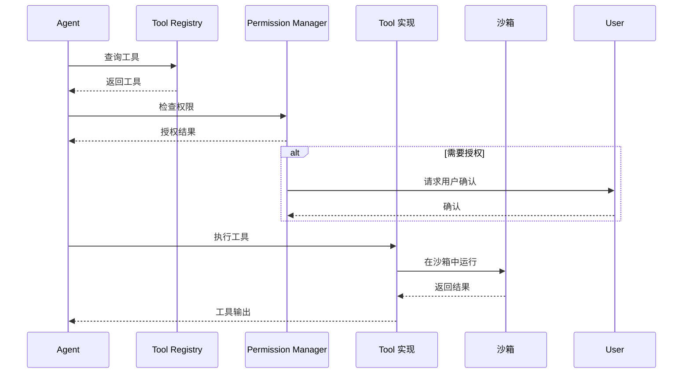

### 5. Prompt Cache - 分段缓存

#### 5.1 缓存策略

采用智能分段策略，最大化缓存命中率：

```rust
pub struct PromptCache {
    /// 系统提示缓存
    system_cache: Arc<RwLock<LruCache<Hash, String>>>,
    /// 工具定义缓存
    tools_cache: Arc<RwLock<LruCache<Hash, String>>>,
    /// 历史对话缓存
    history_cache: Arc<RwLock<LruCache<Hash, Vec<Message>>>>,
    /// 文件内容缓存
    file_cache: Arc<RwLock<LruCache<PathBuf, String>>>,
}
```

#### 5.2 分段设计

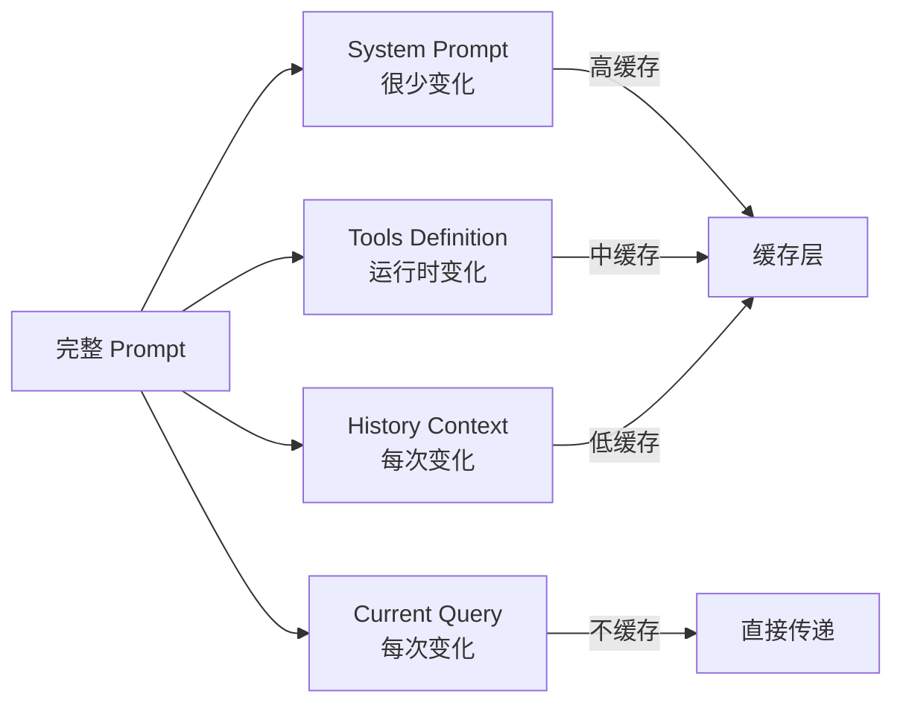

### 6. BUDDY System - 赛博宠物系统

BUDDY 是 ShadowClaude 的情感陪伴模块，提供个性化的交互体验。

#### 6.1 核心概念

```rust
pub struct Buddy {
    /// 宠物 ID
    id: BuddyId,
    /// 个性配置
    personality: Personality,
    /// 情感状态
    emotion: EmotionState,
    /// 记忆
    memory: BuddyMemory,
    /// 成长系统
    growth: GrowthSystem,
    /// 交互历史
    interactions: Vec<Interaction>,
}
```

#### 6.2 个性系统

```rust
pub struct Personality {
    /// 名字
    name: String,
    /// 性格特征
    traits: Vec<Trait>,
    /// 说话风格
    speech_style: SpeechStyle,
    /// 偏好
    preferences: Preferences,
    /// 与用户的关系
    relationship: Relationship,
}
```

#### 6.3 情感计算

```rust
pub struct EmotionState {
    /// 当前情绪
    current: Emotion,
    /// 情绪强度
    intensity: f32,
    /// 情绪趋势
    trend: Trend,
    /// 触发因素
    triggers: Vec<Trigger>,
}

impl EmotionState {
    /// 根据用户输入更新情绪
    pub fn update(&mut self, input: &UserInput) {
        // 情感计算逻辑
    }
}
```

### 7. KAIROS - 守护进程模式

KAIROS 提供后台持续运行的能力，支持定时任务、文件监控等功能。

#### 7.1 架构设计

```rust
pub struct KairosDaemon {
    /// 任务调度器
    scheduler: Scheduler,
    /// 文件监控器
    watcher: FileWatcher,
    /// 通知系统
    notifier: NotificationSystem,
    /// WebSocket 服务器
    ws_server: WebSocketServer,
    /// 状态管理
    state: DaemonState,
}
```

#### 7.2 任务调度

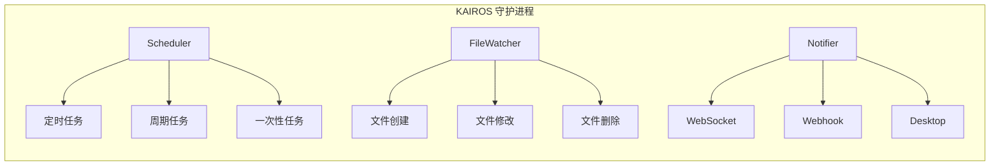

---

## 数据流架构

### 1. 用户查询处理流程

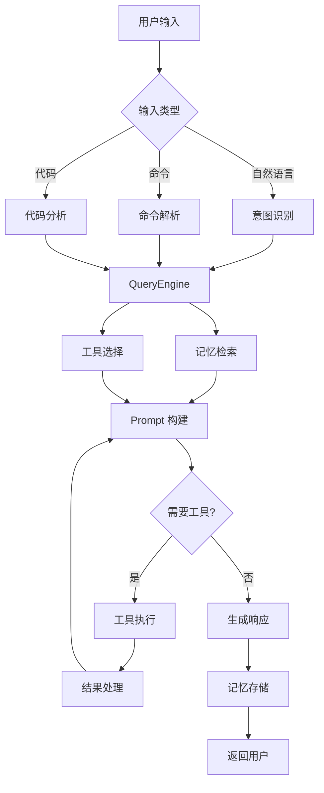

### 2. Agent 协作流程

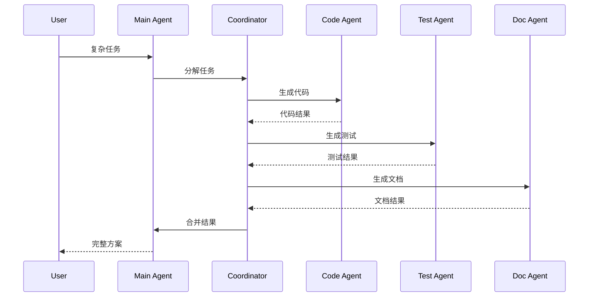

### 3. 记忆存储与检索流程

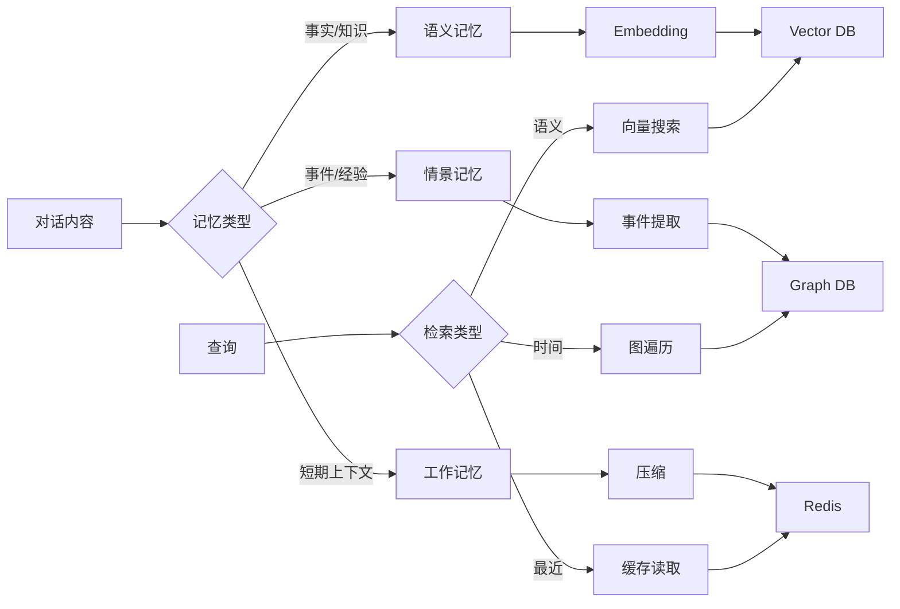

---

## 内存与状态管理

### 1. 状态机设计

```rust
/// 会话状态机
pub enum SessionState {
    /// 初始化中
    Initializing,
    /// 空闲等待
    Idle,
    /// 处理查询
    Processing(QueryId),
    /// 等待用户输入
    AwaitingInput(Prompt),
    /// 执行工具
    ExecutingTool(ToolId),
    /// 错误状态
    Error(ErrorState),
    /// 关闭中
    ShuttingDown,
}

impl StateMachine for SessionState {
    fn transitions(&self) -> Vec<SessionState> {
        match self {
            SessionState::Initializing => vec![SessionState::Idle, SessionState::Error],
            SessionState::Idle => vec![SessionState::Processing, SessionState::ShuttingDown],
            SessionState::Processing(_) => vec![SessionState::Idle, SessionState::AwaitingInput, SessionState::ExecutingTool],
            SessionState::AwaitingInput(_) => vec![SessionState::Processing, SessionState::Idle],
            SessionState::ExecutingTool(_) => vec![SessionState::Processing, SessionState::Error],
            SessionState::Error(_) => vec![SessionState::Idle, SessionState::ShuttingDown],
            SessionState::ShuttingDown => vec![],
        }
    }
}
```

### 2. 内存管理策略

| 层级 | 存储位置 | 容量限制 | 淘汰策略 | 持久化 |
|------|----------|----------|----------|--------|
| L1 | RAM | 10MB | LRU | 否 |
| L2 | Redis | 100MB | TTL | 可选 |
| L3 | Disk | 1GB | FIFO | 是 |
| L4 | Cloud | 无限 | 归档 | 是 |

### 3. 上下文压缩

```rust
pub struct ContextCompressor {
    /// 摘要生成器
    summarizer: Arc<dyn Summarizer>,
    /// 重要性评分器
    importance: Arc<dyn ImportanceScorer>,
    /// 压缩策略
    strategy: CompressionStrategy,
}

impl ContextCompressor {
    /// 压缩对话历史
    pub async fn compress(&self, messages: Vec<Message>) -> Result<CompressedContext> {
        // 1. 按重要性评分
        let scored = self.importance.score_batch(&messages).await?;
        
        // 2. 保留高重要性消息
        let important: Vec<_> = scored.iter()
            .filter(|(_, score)| *score > 0.7)
            .map(|(msg, _)| msg.clone())
            .collect();
        
        // 3. 摘要低重要性消息
        let low_importance: Vec<_> = scored.iter()
            .filter(|(_, score)| *score <= 0.7)
            .map(|(msg, _)| msg)
            .collect();
        let summary = self.summarizer.summarize(&low_importance).await?;
        
        Ok(CompressedContext {
            important_messages: important,
            summary,
        })
    }
}
```

---

## 安全架构

### 1. 六层权限防御

```
┌─────────────────────────────────────────────────────────────┐
│ Layer 6: Application Security (应用层安全)                    │
│ - 输入验证、输出编码、业务逻辑校验                             │
├─────────────────────────────────────────────────────────────┤
│ Layer 5: Agent Sandbox (Agent 沙箱)                          │
│ - Agent 隔离、资源限制、行为监控                               │
├─────────────────────────────────────────────────────────────┤
│ Layer 4: Tool Permission (工具权限)                          │
│ - 工具级权限、参数校验、执行审计                               │
├─────────────────────────────────────────────────────────────┤
│ Layer 3: File System ACL (文件系统 ACL)                      │
│ - 目录访问控制、文件类型限制、敏感文件保护                      │
├─────────────────────────────────────────────────────────────┤
│ Layer 2: Process Isolation (进程隔离)                        │
│ - 命名空间隔离、资源配额、系统调用过滤                         │
├─────────────────────────────────────────────────────────────┤
│ Layer 1: User Consent (用户授权)                             │
│ - 显式确认、权限记忆、撤销机制                                 │
└─────────────────────────────────────────────────────────────┘
```

### 2. Capability-Based 权限模型

```rust
/// 能力令牌
pub struct CapabilityToken {
    /// 能力类型
    capability: Capability,
    /// 作用域
    scope: Scope,
    /// 有效期
    expires_at: Option<DateTime<Utc>>,
    /// 签名
    signature: Signature,
}

pub enum Capability {
    /// 文件读取
    FileRead { paths: Vec<PathPattern> },
    /// 文件写入
    FileWrite { paths: Vec<PathPattern> },
    /// 命令执行
    CommandExecute { allowed_commands: Vec<String> },
    /// 网络访问
    NetworkAccess { allowed_hosts: Vec<String> },
    /// 系统管理
    SystemAdmin,
}
```

### 3. 安全执行流程

```mermaid
sequenceDiagram
    participant User
    participant App as Application
    PM as Permission Manager
    participant Sandbox
    participant OS

    User->>App: 请求操作
    App->>PM: 检查权限
    
    alt 已有授权
        PM-->>App: 允许
    else 需要授权
        PM->>User: 请求确认
        User-->>PM: 确认
        PM->>PM: 发放能力令牌
    end
    
    App->>Sandbox: 在沙箱执行
    Sandbox->>OS: 受限系统调用
    OS-->>Sandbox: 返回结果
    Sandbox-->>App: 执行结果
    App-->>User: 响应
```

---

## 扩展性设计

### 1. 插件系统架构

```rust
/// 插件 trait
pub trait Plugin: Send + Sync {
    /// 插件名称
    fn name(&self) -> &str;
    /// 插件版本
    fn version(&self) -> &str;
    /// 初始化
    fn initialize(&mut self, ctx: PluginContext) -> Result<()>;
    /// 注册钩子
    fn register_hooks(&self, registry: &mut HookRegistry);
    /// 关闭
    fn shutdown(&mut self) -> Result<()>;
}

/// 钩子类型
pub enum Hook {
    /// 预处理用户输入
    PreProcess,
    /// 后处理响应
    PostProcess,
    /// 工具调用前
    PreToolCall,
    /// 工具调用后
    PostToolCall,
    /// 自定义命令
    CustomCommand(String),
}
```

### 2. MCP 协议支持

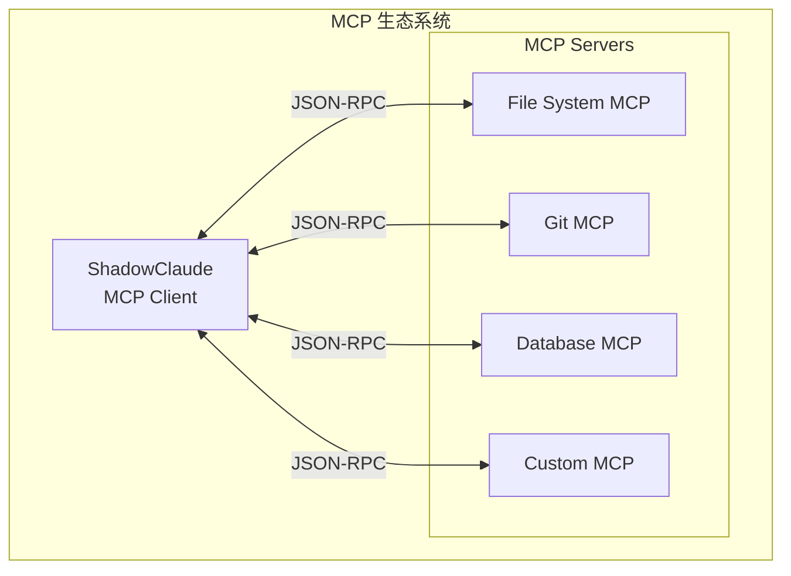

### 3. 水平扩展支持

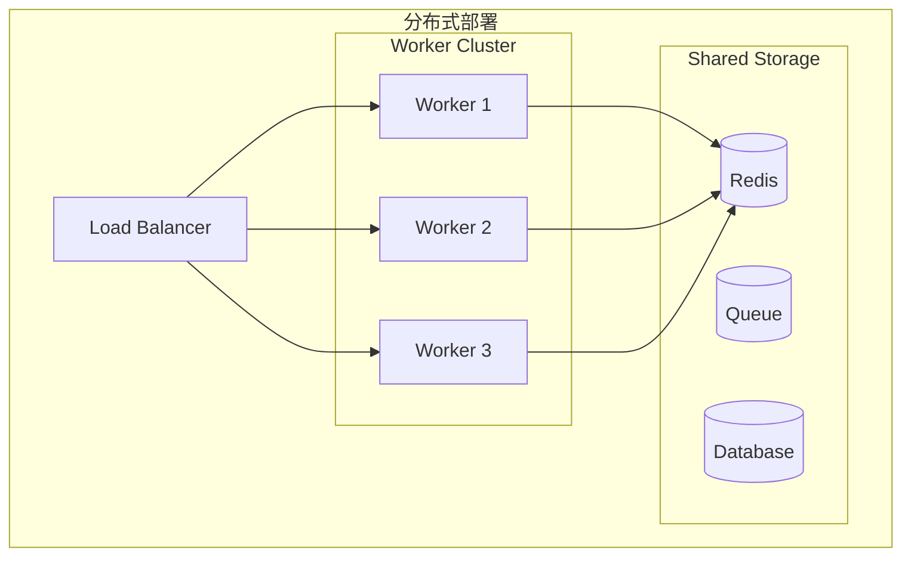

---

## 性能优化策略

### 1. 缓存策略矩阵

| 数据类型 | 缓存策略 | 过期时间 | 命中率 |
|----------|----------|----------|--------|
| 文件内容 | LRU | 5min | 85% |
| 向量检索 | TTL | 1h | 70% |
| LLM 响应 | 语义哈希 | 1d | 60% |
| 工具结果 | 参数哈希 | 10min | 75% |
| 系统提示 | 静态 | 永久 | 99% |

### 2. 并发模型

```rust
/// 使用 tokio 的异步运行时
pub struct AsyncRuntime {
    /// 任务调度器
    scheduler: Scheduler,
    /// 工作线程池
    worker_pool: WorkerPool,
    /// I/O 驱动
    io_driver: IoDriver,
}

/// CPU 密集型任务使用 rayon
pub fn process_parallel(items: Vec<Item>) -> Vec<Result> {
    items.par_iter()
        .map(|item| process_item(item))
        .collect()
}
```

### 3. 批处理优化

```rust
pub struct BatchProcessor<T> {
    /// 批处理大小
    batch_size: usize,
    /// 最大延迟
    max_latency: Duration,
    /// 处理函数
    processor: Arc<dyn Fn(Vec<T>) -> Result<Vec<Output>> + Send + Sync>,
    /// 缓冲队列
    buffer: Arc<Mutex<Vec<T>>>,
}

impl<T: Send + 'static> BatchProcessor<T> {
    pub async fn submit(&self, item: T) -> Result<Output> {
        // 添加到缓冲队列
        let rx = {
            let mut buffer = self.buffer.lock().await;
            buffer.push(item);
            
            // 触发批处理
            if buffer.len() >= self.batch_size {
                self.flush().await?;
            }
            
            // 返回接收器
            self.create_receiver()
        };
        
        rx.await
    }
}
```

---

## 部署架构

### 1. 单机部署

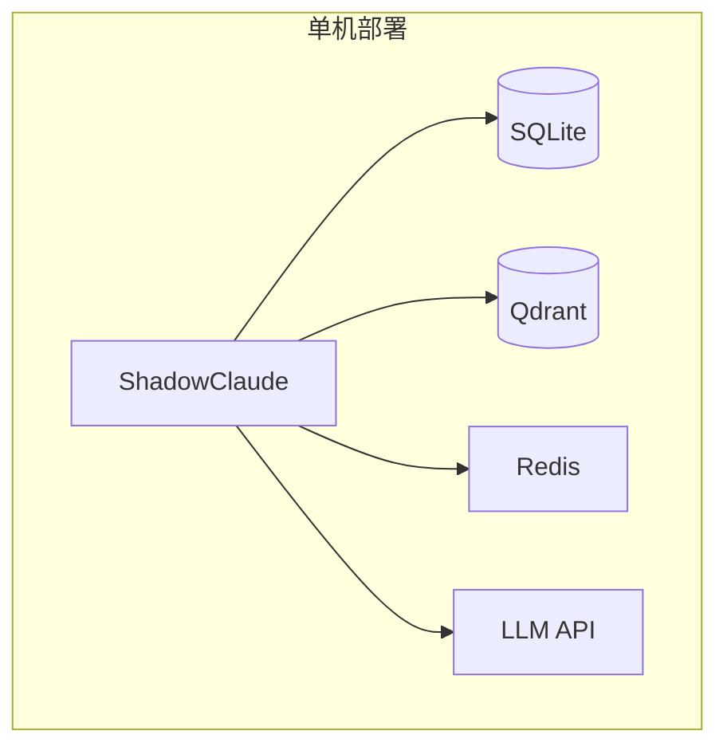

### 2. 生产部署

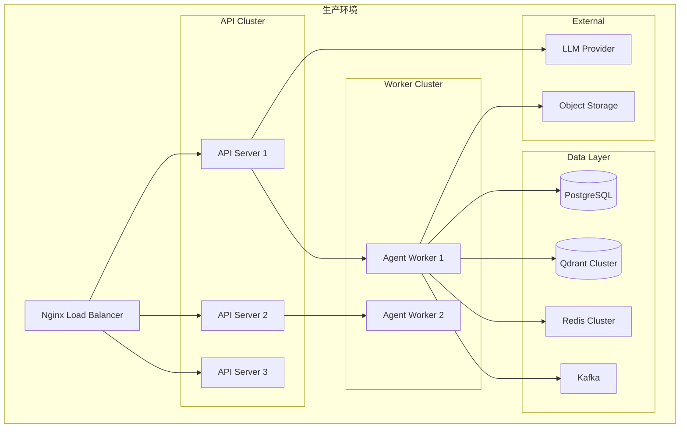

### 3. 容器化部署

```yaml
# docker-compose.yml
version: '3.8'

services:
  shadowclaude:
    image: shadowclaude/shadowclaude:latest
    ports:
      - "8080:8080"
    environment:
      - LLM_API_KEY=${LLM_API_KEY}
      - DATABASE_URL=postgresql://db:5432/shadowclaude
    volumes:
      - ./data:/data
    depends_on:
      - db
      - qdrant
      - redis

  db:
    image: postgres:15
    environment:
      POSTGRES_DB: shadowclaude
      POSTGRES_USER: sc
      POSTGRES_PASSWORD: ${DB_PASSWORD}
    volumes:
      - postgres_data:/var/lib/postgresql/data

  qdrant:
    image: qdrant/qdrant:latest
    ports:
      - "6333:6333"
    volumes:
      - qdrant_data:/qdrant/storage

  redis:
    image: redis:7-alpine
    volumes:
      - redis_data:/data

volumes:
  postgres_data:
  qdrant_data:
  redis_data:
```

---

## 总结

ShadowClaude 的架构设计遵循以下核心原则：

1. **高性能**: Rust 核心保证关键路径性能，智能缓存降低延迟
2. **可扩展**: 模块化设计支持功能按需扩展，插件系统提供无限可能
3. **安全可靠**: 六层权限防御，Capability-based 安全模型
4. **开发者友好**: 清晰的 API 设计，完善的类型系统，丰富的文档

未来演进方向：

- 支持更多 LLM 提供商
- 增强多模态能力
- 完善分布式部署支持
- 构建插件生态系统
- 优化边缘设备部署

---

## 附录

### A. 术语表

| 术语 | 说明 |
|------|------|
| QueryEngine | 查询引擎，ShadowClaude 的核心入口 |
| Coordinator | Agent 协调器，负责任务调度和 Agent 管理 |
| MCP | Model Context Protocol，模型上下文协议 |
| BUDDY | 赛博宠物系统，提供情感陪伴 |
| KAIROS | 守护进程模式，支持后台运行 |
| Undercover | 卧底模式，静默监控和辅助 |
| AutoDream | 自动记忆整合，梦境学习机制 |

### B. 参考文档

- [API 参考文档](../api/)
- [用户手册](../user-guide/)
- [开发指南](../development/)
- [示例代码](../examples/)

### C. 相关项目

- [Anthropic Claude Code](https://github.com/anthropics/claude-code)
- [Model Context Protocol](https://modelcontextprotocol.io/)
- [OpenClaw](https://github.com/openclaw-org/openclaw)

---

*文档版本: 1.0.0 | 作者: ShadowClaude Team | 许可证: MIT*
